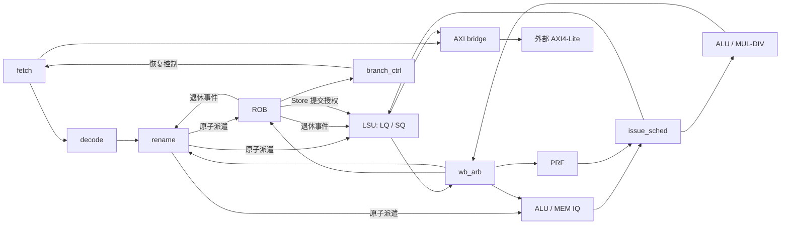

# RV32IM 无缓存乱序核接口规范

版本：v1.0。状态：设计契约，尚未由 RTL 验证。

本文供成员 A、B 独立实现和联调使用。本文与 `plan.md` 的接口描述冲突时，以本文为准；课程外部接口仍以 [README](README-ZH.md)、[AXI 规范](docs/axi4-lite.md) 和框架脚本为准。本次交付只有文档，不表示工具链、顶层、测试或综合已经完成。

## 1. 架构边界与责任

### 1.1 冻结的设计选择

- RV32IM、乱序发射、按序提交、物理寄存器重命名。
- **本版没有缓存**，也没有 Store 转发、投机访存消歧、分支检查点或分支预测表。
- 顺序取指，所有指令预测下一 PC 为 `PC + 4`。分支执行时计算结果，退休时处理误预测。
- 发射宽度支持 1/2/4；派遣、写回、提交宽度各自独立支持 1/2/4。
- 取指与 Load 共享 32 位 AXI 读通道，支持多笔未完成读；最多一笔未完成写。
- Store 仅在 ROB 头部获得写授权，等待写响应后退休。Load 可越过地址已知且字节范围不重叠的旧 Store。
- 恢复时停止发射，清空年轻状态，排空旧执行结果和外部事务，再恢复映射并重新取指。恢复期间不复用事务标识。
- 无 CSR/特权陷入功能；不支持指令和访问错误在退休点进入内部故障状态，不伪造程序退出。

无缓存取指每周期最多接收一个 32 位指令字，且与数据读取竞争总线。本版用于验证功能与接口、研究参数，不沿用有缓存计划中 IPC > 1 的性能承诺。取指队列只保存顺序流中的待消费指令，不进行地址命中或指令复用。

### 1.2 模块与负责人

| 模块 | 主责 | 职责与边界 |
|---|---|---|
| `student_top` | A | 外部端口、实例连接；双方共同审查接线 |
| `fetch` | A | PC、请求槽、取指队列、错误路径取指排空 |
| `decode` | A | RV32IM 译码、非法指令分类 |
| `rename` | A | 推测/提交 RAT、空闲表、物理就绪表、原子派遣协调 |
| `prf` | A | 多端口寄存器数据存储；端口数量双方冻结 |
| `rob` | A | 顺序记录、完成状态、退休与 Store 授权 |
| `branch_ctrl` | A | 退休点重定向、全局恢复状态机、故障锁存 |
| `iq_alu` / `iq_mem` | B | 源操作数就绪跟踪、候选选择；不直接写 PRF |
| `issue_sched` | B | 两队列间选择、PRF 读地址、执行请求缓冲 |
| `alu` × `ISSUE_WIDTH` | B | 整数运算、分支比较、跳转目标与链接值 |
| `mul_div` | B | 单个可变延迟乘除单元 |
| `wb_arb` | B | 结果仲裁、统一写回/完成广播、恢复时结果排空 |
| `lsu` | B | AGU、LQ/SQ、保守消歧、字节处理、Store 提交执行 |
| `axi_bridge` | B | 请求仲裁、外部握手、事务归属与错误响应 |

A 维护公共类型和参数定义；B 审查端口、事务和执行资源约束。修改公共契约须同一变更中更新本文、连接双方和对应验证用例。本文不规定必须使用 SV package/import；逻辑类型与打包布局必须一致，普通 packed 向量即可实现。

### 1.3 数据流



恢复广播实际连接所有有状态模块，图中只画出控制主线。Store 的执行完成和外部写完成是两个独立事件。

## 2. 参数、位宽与命名

### 2.1 参数表

| 参数 | 默认 | 合法范围/约束 |
|---|---:|---|
| `XLEN` | 32 | 固定 32 |
| `ISSUE_WIDTH` (`I`) | 2 | 1、2、4；全核每拍发射总上限 |
| `DISPATCH_WIDTH` (`D`) | 2 | 独立取 1、2、4；译码同宽 |
| `WB_WIDTH` (`W`) | 2 | 独立取 1、2、4；每拍完成接收上限 |
| `COMMIT_WIDTH` (`C`) | 2 | 独立取 1、2、4 |
| `ROB_DEPTH` (`R`) | 32 | 2 的幂，至少 8，且不小于 I/D/W/C |
| `PRF_SIZE` (`P`) | 64 | 至少 `32 + D` |
| `IQ_ALU_DEPTH` / `IQ_MEM_DEPTH` | 16 / 16 | 2 的幂，至少 D |
| `LQ_DEPTH` / `SQ_DEPTH` | 8 / 8 | 2 的幂，至少 D |
| `FETCH_QUEUE_DEPTH` (`F`) | 16 | 2 的幂，至少 D |
| `IFETCH_OUTSTANDING` | 8 | 1–16，且不大于 F |
| `LOAD_OUTSTANDING` | 8 | 1–16，且不大于 LQ 深度 |
| `AXI_RD_OUTSTANDING` | 16 | 1–16；取指与 Load 共享 |
| `RESET_PC` | `32'h00000000` | 4 字节对齐，位于外部 RAM |

两类读事务的配置上限之和可以超过共享上限，由桥施加背压。一个 Store 写事务的上限固定为 1，不作为性能参数。

定义 `IDX(N)=max(1,ceil(log2(N)))`，`CNT(N)=max(1,ceil(log2(N+1)))`。索引宽度和可表示满容量的计数宽度不得混用。

- `PW=IDX(P)`；`RW=IDX(R)`；`RTW=RW+1`。
- `LIDW=IDX(LQ_DEPTH)`；`SIDW=IDX(SQ_DEPTH)`；`FIDW=IDX(F)`。
- 统一读标识宽度 `TIDW=max(FIDW,LIDW)`，较短标识高位补零。
- 物理寄存器编号必须小于 P；未使用的二进制编码不得被分配。
- `FU_SRC_COUNT=I+2`：I 个 ALU 结果源、一个乘除结果源、一个 LSU 结果源。

非法参数组合必须在 elaboration/独立配置检查中报错，不允许静默截断。

### 2.2 信号与打包规则

本文的类型是**逻辑 wire ABI**：类型表从上到下按高位到低位打包，不插入 padding；嵌套类型使用同样规则。总宽度等于字段宽度之和，可由定义生成 localparam。省略的可选字段不存在；表内字段不能私自增删。

数组用 `name[N] : T` 表示 N 个 T；物理扁平化时 lane 0 占最低 `BITS(T)` 位，即 `bus[k*BITS(T) +: BITS(T)]`。表中 `/` 分隔的端口是多个独立端口，方向分别说明。

无效 lane 的载荷置零；有效载荷中不适用字段也置零。例外：无效周期的 PRF 读地址可固定为 p0。lane 0 在有序包中永远最老。

## 3. 公共数据类型

### 3.1 枚举

`op` 为 6 位，编码如下；46–63 保留，解码为非法。

| 编码 | 指令 | 编码 | 指令 | 编码 | 指令 |
|---:|---|---:|---|---:|---|
| 0 | INVALID | 16 | ANDI | 32 | LW |
| 1 | LUI | 17 | SLLI | 33 | LBU |
| 2 | AUIPC | 18 | SRLI | 34 | LHU |
| 3 | JAL | 19 | SRAI | 35 | SB |
| 4 | JALR | 20 | ADD | 36 | SH |
| 5 | BEQ | 21 | SUB | 37 | SW |
| 6 | BNE | 22 | SLL | 38 | MUL |
| 7 | BLT | 23 | SLT | 39 | MULH |
| 8 | BGE | 24 | SLTU | 40 | MULHSU |
| 9 | BLTU | 25 | XOR | 41 | MULHU |
| 10 | BGEU | 26 | SRL | 42 | DIV |
| 11 | ADDI | 27 | SRA | 43 | DIVU |
| 12 | SLTI | 28 | OR | 44 | REM |
| 13 | SLTIU | 29 | AND | 45 | REMU |
| 14 | XORI | 30 | LB | | |
| 15 | ORI | 31 | LH | | |

实现公共枚举时按这些唯一编码定义，不能按指令名称字母排序重新编号。

| 字段 | 位宽 | 编码 |
|---|---:|---|
| `fu` | 2 | 0=整数 ALU/控制流/错误微操作，1=MULDIV，2=MEM，3=保留 |
| `src1_sel` | 2 | 0=RS1，1=PC，2=ZERO，3=保留 |
| `src2_sel` | 2 | 0=RS2，1=IMM，2=FOUR，3=保留 |
| `mem_size` | 2 | 0=字节，1=半字，2=字，3=非法 |
| `redirect_reason` | 2 | 0=分支误预测，1=退休故障，2/3=保留 |
| `fault.code` | 4 | 0=无，1=非法/不支持指令，2=取指地址错误，3=取指访问错误，4=Load 对齐错误，5=Load 访问错误，6=Store 对齐错误，7=Store 访问错误，8=跳转目标对齐错误；其余保留 |

`fault_t` 从高位到低位：`code:4, pc:32, tval:32`。`code=0` 时其他字段为零。非法指令的 tval 是原始指令；访问错误为原始字节地址；跳转对齐错误为实际目标地址。错误优先级：已有取指错误 > 译码错误 > 对齐错误 > 访问错误。

`rob_tag_t`：`wrap:1, index:RW`。分配序号沿模 `2R` 环递增；实时年龄 `age(tag)=(tag-head_tag) mod 2R`，活跃项年龄必须小于当前 ROB 数量。只对同时活跃的 ROB 项比较年龄，不能直接比较裸索引大小。

### 3.2 流水包

| 类型 | 字段（从高位到低位） |
|---|---|
| `fetch_packet_t` | `pc:32, inst:32, pred_npc:32, fault:fault_t` |
| `decoded_uop_t` | `fetch:fetch_packet_t, op:6, fu:2, rs1:5, rs2:5, rd:5, uses_rs1:1, uses_rs2:1, writes_rd:1, imm:32, src1_sel:2, src2_sel:2, is_load:1, is_store:1, is_control:1, mem_size:2, load_unsigned:1` |
| `renamed_uop_t` | `dec:decoded_uop_t, rob:rob_tag_t, ps1:PW, ps2:PW, pdst:PW, old_pdst:PW, has_lq:1, lq_id:LIDW, has_sq:1, sq_id:SIDW` |
| `exec_req_t` | `uop:renamed_uop_t, rs1_value:32, rs2_value:32` |
| `completion_t` | `rob:rob_tag_t, rd_we:1, pdst:PW, value:32, fault:fault_t, branch_valid:1, actual_npc:32` |
| `commit_event_t` | `rob:rob_tag_t, pc:32, inst:32, rd_we:1, rd:5, pdst:PW, old_pdst:PW, is_load:1, lq_id:LIDW, is_store:1, sq_id:SIDW, is_control:1` |
| `redirect_t` | `reason:2, target_pc:32` |

`writes_rd` 是有效写使能：仅当指令有架构目的寄存器、rd 非零且无已知译码错误时为 1。`completion.rd_we` 还必须满足执行无错误。错误微操作保留 PC/inst/fault，但其余解码字段为零、`op=INVALID, fu=ALU`。

每个微操作执行阶段恰有一个完成事件。Store 的完成仅表示地址/数据准备结束（或检测到错误）；外部写响应使用另一个接口。`branch_valid` 只对成功执行的控制流指令为 1；普通 ALU、Load、Store 即使不写寄存器也要发送完成事件。

源就绪状态会在派遣 offer 被背压时变化，因此不放入必须保持稳定的 `renamed_uop_t`；通过第 7 节的实时就绪侧带在 disp_fire 时采样。

### 3.3 字段解释与有效条件

下表补充类型表中的字段语义；嵌套字段沿用其自身类型的规则。所有包字段仅在其 valid/grant/event 有效时被消费。

| 字段 | 含义与有效条件 |
|---|---|
| `pc` / `inst` | 原始指令地址/32 位指令；取指失败时 inst=0，pc 仍有效 |
| `pred_npc` | 该指令的预测下一 PC，本版始终 pc+4；用于退休比较 |
| `op` / `fu` | 操作及路由目标；错误微操作固定 INVALID/ALU |
| `rs1/rs2` / `uses_rs1/uses_rs2` | 架构源编号及是否需要源值；未使用源编号为零；使用 x0 时 uses 仍为 1 |
| `rd` / `writes_rd` | 架构目的编号及有效写使能；不写寄存器时 rd=0 |
| `imm` | 已扩展的 32 位立即数；没有立即数时为零 |
| `src1_sel/src2_sel` | FU 算术输入选择；rs1/rs2 原值仍保留供分支、Store 和跳转使用 |
| `is_load/is_store/is_control` | 指令分类；三者互斥，均为零表示普通运算或错误微操作 |
| `mem_size/load_unsigned` | 仅访存有效；load_unsigned 仅 Load 有意义 |
| `rob` | 指令整个在途生命周期的 ROB 身份，直到退休或 kill |
| `ps1/ps2` | 源物理编号；不需要的源为 p0 |
| `pdst/old_pdst` | 新目的及被替代映射；仅有效寄存器写有意义；旧映射只在成功退休时释放 |
| `has_lq/lq_id` / `has_sq/sq_id` | 队列身份及有效位；仅对应 Load/Store 设置，非访存两者都为零 |
| `rs1_value/rs2_value` | 发射时锁存的原始寄存器值，不预先替换为 PC/IMM |
| `rd_we` | 成功完成/退休时是否写架构目的；WB 据此控制 PRF 和唤醒 |
| `value` | 正常寄存器写结果；无写使能时为零 |
| `branch_valid/actual_npc` | 成功控制流完成的目标信息；实际不跳转也必须传 PC+4 |
| `reason/target_pc` | 恢复原因与恢复后 PC；故障路径不重新取指，target_pc 设为故障 PC |
| `fault` | 错误记录；code 非零为有效；错误优先于正常结果 |
| `id` | 客户端请求槽身份，响应原样回传；不是 AXI 外部信号 |
| `addr/data/strb/resp` | 对齐字地址、32 位字数据、字节写掩码、原始 AXI 响应码 |

`commit_event_t` 的 lq_id/sq_id 分别由 is_load/is_store 限定，不重复携带 has 标志。恢复事件与故障事件分属两个互斥端口；故障端口的 fault.pc 用作内部恢复 PC。

### 3.4 访存类型

| 类型 | 字段（从高位到低位） |
|---|---|
| `mem_read_req_t` | `id:TIDW, addr:32` |
| `mem_read_rsp_t` | `id:TIDW, data:32, resp:2` |
| `mem_write_req_t` | `id:SIDW, addr:32, data:32, strb:4` |
| `mem_write_rsp_t` | `id:SIDW, resp:2` |
| `store_commit_req_t` | `rob:rob_tag_t, sq_id:SIDW` |
| `store_commit_rsp_t` | `rob:rob_tag_t, sq_id:SIDW, fault:fault_t` |

桥接口地址必须为对齐后的字地址。原始地址、大小、Load 符号扩展属性由 Fetch/LSU 的事务记录保存，不占 AXI 字段。`resp=00` 成功；其余值全部按访问错误处理，并保留原值供波形调试。Fetch 标识为取指槽号，Load 标识为 LQ 槽号，桥通过独立 source 位区分命名空间。

## 4. 全局时序和恢复端口

### 4.1 公共端口

除纯组合 `decode` 外，所有模块有输入 `clock:1, reset:1`；高电平同步复位。参与恢复的流水模块接下表控制端口；`branch_ctrl` 产生这些控制，PRF 仅保留时钟、复位和读写端口，顶层不额外暴露恢复端口。完整声明见第 17 节。

| 端口 | 方向（相对受控模块） | 位宽 | 语义 |
|---|---|---:|---|
| `run` | 输入 | 1 | 允许正常工作；为 0 时不新分配/发射/创建业务请求 |
| `kill` | 输入 | 1 | 一拍恢复开始事件；使所有年轻 CPU 状态失效 |
| `restore` | 输入 | 1 | 旧事务全部排空后的一拍映射/队列恢复事件 |
| `restart_pc` | 输入，仅 fetch | 32 | restore 当拍有效，指定恢复后取指 PC |
| `flush_done` | 输出 | 1 | kill 后无旧事务/请求/结果残留，电平保持至 restore/reset |

`prf` 不参与排空确认；其正常写使能受统一 WB 事件控制。`decode` 没有状态，不提供确认。第 17.18 节列出的所有参与模块的 `flush_done` 均必须进入控制器汇总；控制器自身和顶层不产生额外确认，不能遗漏 Fetch 的取指请求或 LSU 的完成缓冲。

### 4.2 三种连接协议

1. **保持型 RV 通道**：`xxx_valid, xxx_ready, xxx_payload`。在上升沿两者均为 1 时传输；阻塞期间 valid 和载荷稳定。生产者的 valid 不组合依赖 ready。允许 ready 依赖 valid，但不得构成组合环。
2. **广播事件**：`xxx_valid[k], xxx_payload[k]`，没有 ready。接收者必须保证全部接收。派遣由全局 fire 控制，写回由仲裁器保证容量，提交由 ROB 保证合法前缀。
3. **候选/预览**：容量、候选、分配槽号、PRF 读地址等组合信息，可每拍变化；仅在对应 grant/fire 上升沿生效，不适用保持型通道规则。

所有本文定义的 RV 通道默认适用第 1 项。唯一取消例外：kill 当拍可撤销**尚未被接收的内部推测请求**（Fetch/Decode/Rename、发射请求及尚未被桥接收的读请求）。桥已接受的请求不能取消；已驱动到 AXI 的 VALID 必须保持，即使尚未握手。FU 已产生的结果用 ready 排空，而非假装结果从未产生。

### 4.3 同拍更新规则

状态更新优先级为 `reset > kill > restore > 正常事件`。控制器发起 kill 当拍禁止普通派遣/发射/写回；**触发该次恢复的分支退休事件是 kill 的明确例外**，必须被提交 RAT 和架构回收逻辑接收。故障指令不产生退休事件。

这套优先级针对 CPU 架构/推测状态，不取消总线履约：kill 当拍及 drain 期间发生的 AXI 握手、内部旧响应消费和 FU 结果排空仍须更新 pending 位及未完成计数。特别是“kill 与最后一笔旧读响应同拍”必须消费响应并减计数，不能因为 kill 优先而漏记，造成永久等待。kill 清空的是年轻有效状态，不是所有协议计数器。

正常周期内：

- 完成事件只更新当前活跃且标签相等的 ROB 项；不能被下一周期的新项误收。
- 提交只依据周期开始时已记录的完成状态；当拍写回最早下一拍提交。
- 提交更新提交 RAT，派遣更新推测 RAT，各自按 lane 从老到新进行。
- 当拍释放的物理寄存器、ROB/IQ/LQ/SQ 槽位从下一拍起参与分配，不进行容量组合穿透。
- 当拍 WB 可使当拍被派遣微操作的源就绪；Rename 的实时就绪侧带必须包含当拍 WB 匹配结果。已在 IQ 中的依赖最早下一拍参加选择。
- 新物理目的寄存器分配清除 ready；WB 设置 ready。合法情况下两者不能对同一个 pdst 同拍发生，必须检查此不变量。

## 5. 外部顶层端口

`student_top` 不增加 OJ 必需输入，也不把内部调试接口变成顶层必需端口。

| 端口 | 方向 | 位宽 |
|---|---|---:|
| `clock` / `reset` | 输入 | 各 1 |
| `araddr` | 输出 | 32 |
| `arvalid` | 输出 | 1 |
| `arready` | 输入 | 1 |
| `rdata` | 输入 | 32 |
| `rresp` | 输入 | 2 |
| `rvalid` | 输入 | 1 |
| `rready` | 输出 | 1 |
| `awaddr` | 输出 | 32 |
| `awvalid` | 输出 | 1 |
| `awready` | 输入 | 1 |
| `wdata` | 输出 | 32 |
| `wstrb` | 输出 | 4 |
| `wvalid` | 输出 | 1 |
| `wready` | 输入 | 1 |
| `bresp` | 输入 | 2 |
| `bvalid` | 输入 | 1 |
| `bready` | 输出 | 1 |

外部内存小端，RAM 为 `0x00000000..0x0fffffff`。默认延迟来自仿真从机，CPU 中不得实现“等待固定 10 拍就认为数据有效”的逻辑。

## 6. Fetch → Decode → Rename

### 6.1 前端端口

| 连接 | 信号 | 类型/宽度 | 协议 |
|---|---|---|---|
| Fetch → bridge | `if_req_valid/ready/payload` | 1/1/`mem_read_req_t` | RV，ready 返回 Fetch |
| bridge → Fetch | `if_rsp_valid/ready/payload` | 1/1/`mem_read_rsp_t` | RV，ready 返回桥 |
| Fetch → Decode | `fetch_valid/ready/count/packet[D]` | 1/1/`CNT(D)`/`fetch_packet_t` | 整包 RV |
| Decode → Rename | `decode_valid/ready/count/uop[D]` | 1/1/`CNT(D)`/`decoded_uop_t` | 整包 RV |

count 在 valid 时为 1..D，lane `[0,count)` 连续有效。下游必须整包接受；不能只消费第 0 lane 而忽略剩余 lane。Fetch 将最老、连续、已返回的至多 D 条形成保持型输出包，一旦 valid 为 1，count 也不得在背压中增大。

Fetch 的队列槽从创建请求 offer 时预留，保存 PC/预测 PC/请求状态/数据/错误。收到响应不再临时申请空间。读请求在桥接受后计入 IFETCH_OUTSTANDING，在响应被 Fetch 接收后解除该额度；槽位在指令包被消费后才释放。超过 RAM 范围的顺序 PC 不发外部请求，而在对应槽内形成取指地址错误包，仍保持顺序。

每拍至多形成一个新取指请求，PC 在该请求 offer 被创建时推进 4；offer 被背压时不重复推进。相同槽位在释放前不可再次用作请求标识。对齐 PC 的 32 位加法按模 2^32 执行。

Decode 为纯组合转换，`decode_valid=fetch_valid`，`fetch_ready=decode_ready`，count 原样传递。Rename 的输入缓冲保证包被接收后不再依赖 Fetch 的载荷。

### 6.2 译码映射

| 指令组 | 使用源 | 写 rd | imm | src1/src2 | 目的 FU |
|---|---|---|---|---|---|
| LUI | 无 | 是 | U | ZERO/IMM | ALU |
| AUIPC | 无 | 是 | U | PC/IMM | ALU |
| JAL | 无 | 是 | J | PC/FOUR | ALU |
| JALR | rs1 | 是 | I | RS1/IMM | ALU |
| 条件分支 | rs1、rs2 | 否 | B | RS1/RS2 | ALU |
| 整数立即数 | rs1 | 是 | I | RS1/IMM | ALU |
| 整数寄存器 | rs1、rs2 | 是 | 0 | RS1/RS2 | ALU |
| Load | rs1 | 是 | I | RS1/IMM | MEM |
| Store | rs1、rs2 | 否 | S | RS1/IMM | MEM |
| M 扩展 | rs1、rs2 | 是 | 0 | RS1/RS2 | MULDIV |

I/S/B/J 立即数符号扩展到 32 位；U 为 `inst[31:12] << 12`。I=`inst[31:20]`；S=`{inst[31:25],inst[11:7]}`；B=`{inst[31],inst[7],inst[30:25],inst[11:8],0}`；J=`{inst[31],inst[19:12],inst[20],inst[30:21],0}`。移位使用低 5 位 shamt，并检查合法 funct 编码。JAL/JALR 结果固定 PC+4，实际目标由单独的分支运算计算，不把上述 src 选择当成全部控制逻辑。

`LB/LBU/SB` size=0，`LH/LHU/SH` size=1，`LW/SW` size=2；只有 LBU/LHU 的 load_unsigned=1。RV32I/M 其他非合法编码，包括本课程免除的 CSR、FENCE、FENCE.I、ECALL、EBREAK，均编码为错误微操作，不静默当 NOP。

## 7. Rename 的原子分配契约

### 7.1 容量与槽位预览

| 生产者 → Rename | 端口 | 类型 | 语义 |
|---|---|---|---|
| ROB | `rob_free` | `CNT(R)` | 周期开始时可分配数 |
| ROB | `rob_alloc_tag[D]` | `rob_tag_t` | 从当前尾部连续分配的候选标签 |
| ALU IQ | `alu_iq_free` | `CNT(IQ_ALU_DEPTH)` | 空闲项数 |
| MEM IQ | `mem_iq_free` | `CNT(IQ_MEM_DEPTH)` | 空闲项数 |
| LSU | `lq_free/sq_free` | 各自 `CNT(depth)` | 空闲项数 |
| LSU | `lq_alloc_id[D]/sq_alloc_id[D]` | `LIDW`/`SIDW` | 最低编号空闲槽优先的候选表 |

仅预览前 min(D,free) 项有效。ROB 采用尾部顺序分配；LQ/SQ 采用空闲位图分配，不用物理槽号表示年龄。IQ 入队槽由队列自身分配，不跨模块暴露槽位。

### 7.2 派遣端口

| 生产者 → 消费者 | 信号 | 宽度/类型 |
|---|---|---|
| Rename → 顶层容量判定 | `disp_valid` | 1，已锁定一个派遣包 |
| 组合容量判定 → Rename | `disp_ready` | 1，所有资源足以接收该包且 run=1 |
| Rename → ROB/IQ/LSU | `disp_count` | `CNT(D)` |
| Rename → ROB/IQ/LSU | `disp_uop[D]` | `renamed_uop_t` |
| Rename → IQ | `disp_src1_ready[D]/disp_src2_ready[D]` | 每项 1，实时组合预览，仅在 disp_fire 采样 |
| 顶层 → ROB/IQ/LSU | `disp_fire` | `disp_valid && disp_ready && !kill` |

实际写入仅由 disp_fire 触发：ROB 接收所有 lane，ALU IQ 接收 fu!=MEM 的 lane，MEM IQ 接收 fu=MEM 的 lane，LSU 仅分配带 has_lq/has_sq 的 lane。队列可以在内部压紧 lane，但必须保持包内顺序。

Rename 具有一个译码包缓冲和一个派遣 offer 寄存器。对译码包从最老指令起选择可容纳的最大前缀（至少一条），计算所有资源需求后锁存完整重命名结果、候选槽号及 count；未取走的后缀保留在译码缓冲中。该前缀对外一旦 valid，就不可部分接受或改变。

创建 offer 不改变 RAT/空闲表/队列分配状态；只有 disp_fire 才同时生效。offer 存在时不创建第二个 offer，因此候选槽不会被另一个生产者占用；候选 ID 必须锁存，不能因其他项释放而重新挑选。容量只会保持或增加。disp_valid 来自寄存器，不能组合等于 disp_ready。

对包内每条指令按程序顺序：读取临时 RAT 的源映射，记录旧 rd 映射，分配最低编号空闲 pdst，再更新临时 RAT；后续 lane 读取更新后的映射。新分配 pdst 的就绪位为 0。未使用源统一映射 p0 且 ready=1，源为 x0 同样处理。

就绪侧带从当前物理就绪表读取并合入本周期成功 WB；若源等于本 offer 内较老 lane 新分配的 pdst，则强制未就绪。此侧带不是 RV 载荷，可在背压时从 0 变为 1；IQ 必须在 disp_fire 时采样。这样即使结果在 offer 建立之后、实际入队之前返回，也不会丢失唤醒。保持型 disp_uop 中的编号和其他字段不变。

有写使能才分配 pdst；否则 `pdst=old_pdst=0`。Load/Store 分别按其在包内出现的次序取 LQ/SQ 候选槽。译码错误不占 LQ/SQ，进入 ALU IQ 产生错误完成。

复位：推测/提交 RAT 均为 xN→pN；p0..p31 就绪，p32..空闲且未就绪。p0 永不写入或回收。PRF 的初始架构寄存器值为零。

## 8. IQ、发射选择和 PRF

### 8.1 IQ 和调度器端口

IQ 接收第 7 节的派遣广播、第 10 节的 WB 广播，以及 ROB 的 `rob_head_tag:rob_tag_t`。两个 IQ 分别输出：

| 端口 | 方向（IQ） | 类型 | 语义 |
|---|---|---|---|
| `cand_valid[I]` | 输出 | 每项 1 | 至多 I 个最老操作数就绪候选 |
| `cand_slot[I]` | 输出 | `IDX(IQ_DEPTH)` | 本队列槽号 |
| `cand_uop[I]` | 输出 | `renamed_uop_t` | 候选信息 |
| `cand_take[I]` | 输入 | 每项 1 | 本上升沿被调度器取走 |

这是候选协议，不是 RV；候选每拍可变化。take 必须是 valid 的子集，同队列同槽最多取一次。IQ 项在 take 上升沿释放；不能仅因源就绪或看到候选就释放。

`issue_sched` 合并两个队列候选，按 ROB 年龄逐个选择可容纳的最老候选，每拍总数不超过 I。可跳过目标入口没有空位的候选。本版允许被阻塞候选占据候选表而暂时降低发射量，不要求越过候选表搜索更年轻项。

调度器维护 I 个 ALU 入口缓冲、一个 MULDIV 入口缓冲、一个 MEM 入口缓冲，各深度 1。仅周期开始时为空的入口可接受新候选，不做出队入队组合穿透；一个周期同一入口至多填入一条。整数候选分配最低编号可用 ALU 入口。各入口向执行单元提供独立 `exec_valid/ready/payload:exec_req_t` RV 通道。

调度器只根据入口空位取候选，不根据执行单元 ready 临时生成脉冲。入口一旦填入就稳定保持，直到执行单元握手或 kill 取消。PRF 数据在 cand_take 的上升沿与微操作一起锁存进对应入口。

### 8.2 PRF 端口

| 端口 | 方向（PRF） | 类型/宽度 | 生效条件 |
|---|---|---|---|
| `rd_addr[2I]` | 输入 | PW | 组合读地址 |
| `rd_data[2I]` | 输出 | 32 | 对应寄存器值 |
| `wr_en[W]` | 输入 | 1 | WB 有效且 rd_we=1 且 pdst!=0 |
| `wr_addr[W]` | 输入 | PW | 写目的 |
| `wr_data[W]` | 输入 | 32 | 上升沿写入 |

全局选择序号 k 使用读口 2k/2k+1，读取原始 rs1/rs2 值；PC/IMM 选择在 FU 内完成。p0 总是返回零。多个有效写口不得指向相同 pdst。

读写同址采用显式组合写数据旁路定义为新值，但本版调度不依赖同周期 wakeup/select。初版 PRF 采用触发器阵列；单端口 sram_fakeram 不能直接满足该接口，不要求把 PRF/RAT/IQ 强行实现为 SRAM。

## 9. 执行单元接口与语义

ALU、MULDIV 接收 `exec_valid/ready/payload`，输出 `result_valid/ready/payload:completion_t`；LSU 的 AGU 输入同型，结果输出也同型。

- ALU：一项结果寄存器，执行请求被接收后最早下一周期 result_valid=1。无空结果槽则不接收新请求；允许不实现同拍结果出队/新请求入队优化。
- MULDIV：一次只接收一条，busy 时不接收下一条；结果 valid 持续到 ready。延迟不属于公共契约，不能由 ROB/IQ 假定。
- LSU：AGU 对一个请求计算地址并锁存到其 LQ/SQ，入口必须有一项完成缓冲容量；Load 不在 AGU 时产生完成，而在读响应或本地错误形成后产生。
- 所有 FU 遇到已带 fault 的微操作，原样传播 fault，不执行外部副作用。
- kill 时未进入 FU 的请求可取消；已进入 FU 的请求可以内部终止，或者完成后排空，但 flush_done 之前必须保证不会再产生旧结果。

整数结果按 32 位截断。移位量使用低 5 位。SLT/BLT/BGE 与算术右移按有符号解释，U 变体按无符号解释。

分支实际下一 PC：条件成立时 PC+imm，否则 PC+4；JAL 为 PC+imm；JALR 为 `(rs1+imm)&~1`。实际下一 PC 非 4 字节对齐时报跳转对齐错误，不更新链接寄存器。正常 JAL/JALR 写入 PC+4。

M 扩展必须覆盖：

| 情况 | 结果 |
|---|---|
| MUL | 乘积低 32 位 |
| MULH / MULHSU / MULHU | 分别按有符号×有符号、有符号×无符号、无符号×无符号求 64 位乘积的高 32 位 |
| DIV/DIVU 除零 | `0xffffffff` |
| REM/REMU 除零 | 原被除数 |
| DIV `0x80000000 / 0xffffffff` | `0x80000000` |
| 同上 REM | 0 |
| 正常有符号除法 | 商向零截断，非零余数符号与被除数一致 |

## 10. 完成仲裁、写回与唤醒

| 连接 | 端口 | 类型 |
|---|---|---|
| 每个 FU/LSU → wb_arb | `result_valid/ready/payload` | RV，`completion_t` |
| wb_arb → ROB/PRF/Rename/IQ | `wb_valid[W], wb_payload[W]` | 广播，`completion_t` |

结果源编号为 ALU0..ALU(I-1)、MULDIV、LSU。仲裁从轮询指针开始环形扫描，最多接受 W 个有效源，每源每拍最多一个；指针移到最后一个被接受源之后，没有接受则保持。有效 WB lane 压紧到低位。

正常 run 时，`result_valid && result_ready` 与恰一个 wb_valid 事件一一对应。ROB 的完成端口固定能接受 W 条；PRF 和各 ready 表同时应用对应更新，不再有下游 ready。不能“先唤醒，下拍再等 PRF 有空写入”。

错误完成也占用一个 WB lane，更新 ROB fault，不写 PRF、不唤醒目的源。年轻指令可能永远等不到该结果，最终由精确故障恢复清除。无目的寄存器的正常完成同样占一个 lane。

drain 时各结果输入 ready=1，可独立丢弃全部结果；所有 wb_valid=0。非法或非活跃 ROB 标签在正常模式属于设计错误，验证中应断言，而不是静默当作正常的迟到响应。

## 11. ROB、提交和控制流

### 11.1 端口

ROB 接收派遣、WB、公共控制，输出第 7 节容量和 `rob_head_tag`；另外连接：

| 连接 | 端口 | 类型/语义 |
|---|---|---|
| ROB → Rename/LSU/调试 | `commit_valid[C], commit_payload[C]` | 广播 `commit_event_t`，连续有效前缀 |
| ROB → IQ/issue_sched/LSU | `rob_head_tag` | `rob_tag_t`，用于活跃候选与 LSQ 项年龄比较 |
| ROB → LSU | `st_commit_valid/ready/payload` | RV，`store_commit_req_t` |
| LSU → ROB | `st_done_valid/ready/payload` | RV，`store_commit_rsp_t` |
| ROB → branch_ctrl | `recover_valid, recover_payload` | 广播 `redirect_t`，一拍事件 |
| ROB → branch_ctrl | `fault_valid, fault_payload` | 广播 `fault_t`，一拍事件 |

ROB 每项至少保存：完整派遣记录、done、fault、actual_npc、Store 提交状态。Store 状态为未授权/已请求/响应成功/响应失败，不允许对同一项重复发送请求。

### 11.2 退休规则

普通指令从头部取最多 C 条连续完成且无错的前缀。遇到未完成、Store、控制流或错误项停止；较老普通前缀可以先退休，特殊项留到下一周期。

控制流仅在其本身处于头部时单独退休，其他 commit lane 无效。成功执行后比较 actual_npc 与 pred_npc：相等则正常退休；不等则当拍发布该分支 commit 事件和 recover 事件。比较的是下一 PC，不是单独的 taken 位。

Store 仅在头部、执行已完成且无 fault 时发出一次 st_commit 请求，直到握手保持稳定；等待响应期间不退休年轻指令。收到成功响应后记录状态，最早下一周期单独退休；错误响应在下一周期进入精确故障流程。错误 Store 不产生 commit 事件。

Load 的 LQ 槽在 commit 事件才释放，读返回/WB 时不提前复用。SQ 槽在 Store commit 事件才释放。其他资源分别在 IQ take、ROB retire、物理旧映射 retire 时释放。

commit 广播没有 ready：Rename 和 LSU 必须有能力接收每拍 C 条。按 lane 顺序更新提交 RAT 和释放 old_pdst，正确处理同拍对同一架构寄存器的多次写；不能仅保留最后一个 old_pdst 的释放。

### 11.3 内部调试信号

`commit_valid/payload` 可直接供 testbench 采集退休轨迹；`branch_ctrl` 输出保持型 `faulted:1, fault_info:fault_t` 供内部观测。它们不是外部 OJ 协议，不添加必需顶层输入。faulted 不通过退出 MMIO编码“成功结果”。

## 12. LSU：地址、消歧与 Store 授权

### 12.1 端口和存储记录

LSU 接收派遣、执行请求、commit 广播和 Store 授权；输出第 7 节 LQ/SQ 预览、第 10 节完成结果以及：

| 连接 | 端口 | 载荷 |
|---|---|---|
| LSU → bridge | `ld_req_valid/ready/payload` | `mem_read_req_t` |
| bridge → LSU | `ld_rsp_valid/ready/payload` | `mem_read_rsp_t` |
| LSU → bridge | `st_req_valid/ready/payload` | `mem_write_req_t` |
| bridge → LSU | `st_rsp_valid/ready/payload` | `mem_write_rsp_t` |

LQ 项保存 allocated、ROB 标签、pdst/写使能、PC、原始地址、size/unsigned、地址就绪、请求已接受、返回数据/错误、完成待发送/已发送。SQ 项保存 allocated、ROB 标签、PC、原始地址、对齐字地址、数据/strb、地址数据就绪、执行完成是否已发送、授权/请求/响应状态。

AGU 等待 Store 两个源都就绪，地址和数据一起锁存；本版不拆分 Store 地址/数据微操作。由此“地址未知”也包括数据尚未就绪、尚未进入 AGU 的情况。

LSU 使用一个保持型 completion 输出缓冲。从 LQ 已返回/本地错误项及 SQ 待发送执行完成项中按 ROB 年龄选择最老项填入，待 wb_arb 接收后标记已发送，防止重复完成。响应数据存入原 LQ 槽，因此 WB 背压不会要求额外分配 LQ。

### 12.2 字节语义与合法性

有效地址为 `rs1 + imm` 的 32 位结果。字节访问任意对齐；半字要求 bit0=0；字要求 bits[1:0]=0。对齐检查在地址范围检查之前。通过对齐检查后：

```text
aligned_addr = effective_addr & 0xfffffffc
offset       = effective_addr[1:0]
nbytes       = 1 << mem_size
strobe       = ((1 << nbytes) - 1) << offset
write_data   = rs2_value << (8 * offset)
load_bits    = read_data >> (8 * offset)
```

Load 按 size 截取后符号/零扩展。采用 33 位范围运算验证最后一个访问字节，避免地址加法溢出造成越界检查绕过。

Load 仅允许 RAM；Store 允许 RAM，或地址恰为 `0x80000000` 的 SW。其他地址本地形成访问错误，不发总线。退出地址的 SB/SH 不允许。总线非 OKAY 响应仍须处理，不能因已有本地检查而忽略。

### 12.3 保守消歧

对每个地址就绪且未请求的 Load，扫描所有更老的已分配 SQ 项：

- 存在地址未知项：不可发出 Load。
- 存在访问同一对齐字且字节掩码有交集的项：必须等该 Store 成功响应。
- 地址不同或同字但掩码无交集：不构成阻塞。
- Store 响应成功但尚未退休时可视为已对外完成，不再阻塞 Load；失败则不解除相关依赖，等待故障恢复。

不同 Load 可以乱序选择，按最老合格项优先。每拍最多建立一个 ld_req offer，锁存后保持；直到请求被桥接收才设置 issued。未完成读额度在桥接受时增加、LSU 接收响应时减少。

不能以“Store 已获提交授权”“AW/W 已握手”代替写完成，框架读写服务并无该种顺序保证。必须以成功的 st_rsp 接收作为解除重叠依赖的依据。

### 12.4 Store 提交

st_commit 只接收匹配当前有效 SQ/ROB 且执行完成已发送的项。LSU 锁存授权后构造 st_req；桥接受后等待 st_rsp，再产生保持型 st_done。st_done 被 ROB 接收前保持载荷稳定。

同一时刻只处理一个获授权 Store。已成功响应的 SQ 项一直保留到 commit 事件。外部退出 SW 在 B 握手瞬间可能令框架终止，不要求仿真继续跑到内部 st_done 和退休。

## 13. AXI 桥的队列和握手

桥具有第 6/12 节 IF/LD/ST 三组请求与响应（共六条内部 RV 通道），外部端口与第 5 节一致。桥不解析 CPU 微操作，不拥有 ROB，不施加固定 10 拍延迟。

### 13.1 读通路

维护最多 AXI_RD_OUTSTANDING 项的事务队列，每项包括 source(IF/LD)、id、addr、AR 状态、返回状态、rdata/rresp。接受内部请求即占一个额度，直到响应被对应内部客户端消费才释放。

- IF/LD 同时 valid 时轮询选择；初始 IF 优先，每次接受后优先权移向另一方。一次最多接收一个请求。
- 内部 ready 由空闲额度和仲裁产生；请求被接受后，即使 kill 也必须完成该事务。
- AR 顺序发送所有已接受但未发送的事务。arvalid 拉高后保持 addr/valid，直到 arready。
- R 按最老“已发 AR 且未接收 R”的事务匹配；不得按内部响应是否已消费来移动错误的匹配指针。
- 接收 R 前对应事务项已预留数据存储。允许存满多个返回数据，避免一个客户端背压丢失后续 R。
- 内部响应按总接受顺序交付，每拍最多一个；队首属于 IF 就只驱动 if_rsp，属于 LD 就只驱动 ld_rsp。此版本允许客户端背压造成队首阻塞。
- 队列满时施加请求背压；本周期释放额度从下一周期可用。AXI 无 ID，不输出虚构 ID 端口。

AR 在本拍握手的事务从下一拍开始可匹配 R，不依赖同拍零延迟响应。框架保证请求不会在同一接受拍产生响应；独立 testbench 遵守这一边界。

### 13.2 写通路

桥只有一个写事务槽，接受 st_req 后保存 id/addr/data/strb，分别设置 aw_pending 和 w_pending：

- awvalid 在 AW 握手前保持，wvalid 在 W 握手前保持，二者独立清除。
- 任一通道已成功后不得重复发送，也不得等待另一通道 ready 才开始驱动本通道 valid。
- 两者都握手后等待 B；bready 仅在有已完整发送的写事务且响应缓冲空闲时拉高。
- B 握手后保存 bresp，输出 st_rsp；st_rsp 被 LSU 接收后才释放整个写槽。

退出写遵循完全相同的 AXI 协议。桥不拦截 B 来阻止正常退出，也不在 AW/W 握手时报告完成。

### 13.3 恢复期间

kill 后不再接收新的 IF/LD/st 请求；已接受的读请求继续发送 AR、收 R、交付标记为旧事务的响应。Fetch/LSU 处于 drain，响应 ready 必须保持可接收并丢弃数据。桥不需要 epoch；系统在它 flush_done 前不恢复发射，也不重用请求槽。

正常设计中误预测/故障触发时不存在已授权而未完成的年轻 Store。若写槽仍有已授权事务，桥必须完成排空，不能撤销已经出现的 AXI VALID。验证须检查“授权 Store 只能是 ROB 头部”这个根本不变量。

## 14. 全局恢复状态机与精确故障

### 14.1 控制端口

`branch_ctrl` 接收 ROB 的 recover/fault 事件、所有参与模块的 flush_done，输出 run/kill/restore/restart_pc 和内部 faulted/fault_info。recover 与 fault 不得同拍有效；recover_payload.reason 固定为 0，fault 事件由控制器内部转换为 reason=1、target_pc=fault.pc。复位默认 run 在复位释放后的正常周期生效，PC 初始化为 RESET_PC。

| 状态 | run | 行为 |
|---|---:|---|
| RUN | 1，触发恢复当拍压低 | 正常运行；ROB 产生恢复事件时组合产生 kill |
| DRAIN | 0 | 等待全部 flush_done；只允许旧事务/旧结果排空 |
| RESTORE | 0 | restore=1 一拍，重建映射、空闲表和队列初态 |
| FAULTED | 0 | 保持故障，不再取指、派遣或提交；仅 reset 可离开 |

RUN 中 ROB 触发事件的判断只依据当前已寄存状态，不组合依赖 run，避免 kill/run/ROB 之间形成环。正常提交输出在 kill 时全部屏蔽，唯独误预测分支自己的单条 commit 事件保留。

误预测路径：RUN→DRAIN→RESTORE→RUN。故障路径：RUN→DRAIN→RESTORE→FAULTED。错误指令和年轻指令均不退休。fault_info 在 fault 事件被锁存，并保持到 reset。

### 14.2 每个模块的恢复责任

| 模块 | kill / drain | flush_done 条件 | restore |
|---|---|---|---|
| Fetch | 取消未被桥接受的 offer、清空输出；保留已接受事务计数以丢弃响应 | 所有旧取指响应已接收，无旧输出 | 清空槽/指针，PC=restart_pc |
| Rename | 清空译码/派遣 offer；接收触发分支的提交更新 | 无待输出包 | 从更新后提交 RAT 恢复推测 RAT及空闲/ready 表 |
| ROB | 清空全部年轻活跃项，停止授权 | 无挂起 Store 请求/响应 | 头尾与 wrap 归零，空 ROB |
| IQ | 清空全部项 | 无候选/项 | 空队列 |
| issue_sched | 取消入口中尚未被 FU 接收的请求 | 所有入口空 | 空入口 |
| ALU/MULDIV | 终止或完成已接收工作，结果交给 drain 丢弃 | 不忙且没有有效结果 | 空闲 |
| wb_arb | wb_valid=0，接受并丢弃所有旧结果 | 无内部结果状态 | 仲裁指针归零 |
| LSU | 清除年轻逻辑状态；保留已接受读计数直至响应丢弃 | 无旧读/写/完成输出/提交响应 | LQ/SQ 清空、额度归零 |
| AXI bridge | 完成所有已承诺 AXI 请求与响应交付 | 读事务队列、写槽均空，AXI 输出无待握手 VALID | 清空指针和仲裁状态 |

flush_done 必须表示本模块不会再主动产生旧工作；有上游输入的模块仍保持 drain 接收能力，直到全局恢复。控制器必须汇总生产者和消费者全部 done，不能只看某个输出当前为零。例如 wb_arb 自身无缓存可立即 done，但仍须接收尚未 done 的乘除单元结果。所有 done 均保持至 restore，不使用容易漏采的脉冲。

RESTORE 时：将提交 RAT 中所有映射标记 allocated/ready，其他物理寄存器标记 free/not-ready，始终保留 p0。提交映射必须一一对应不同物理寄存器。PRF 不清零已提交值；年轻指令写过的无效物理值可保留，因为 ready 已被清除。

这保证 JAL/JALR 链接寄存器先提交再恢复；不能使用更新前提交 RAT 快照。因为旧结果已经全部排空，ROB wrap 重置和 LQ/Fetch 槽复用不会发生跨恢复别名。

错误路径 Load/取指错误只作为普通带 fault 结果存入年轻 ROB；被分支冲刷就丢弃。不得在响应出现时直接 faulted。硬件故障状态不实现系统陷入入口，也不尝试继续执行故障指令。

## 15. 逐拍示例

约定：表中 t 是一个周期，动作在该周期末上升沿生效；“下一拍”指 t+1。示例假定非相关资源空闲。

### 15.1 包内 RAW/WAW 与原子停顿

初始 x1→p1，空闲 p32/p33。包为 `addi x1,x0,1; addi x1,x1,2`。

| 周期 | 行为 |
|---|---|
| t | Rename 锁存 proposal：lane0 pdst=p32, old=p1；lane1 ps1=p32, pdst=p33, old=p32 |
| t+1 | 只有资源齐备时 disp_fire；两个 ROB 项、两个 IQ 项和 RAT 一起更新为 x1→p33 |
| 后续 | lane1 等待 p32 的 WB，不能用 p1；若 proposal 被背压，以上编号/count 均保持 |
| 退休 | 先释放 p1，再释放 p32；即使同拍退休也必须两次释放，提交映射最终为 p33 |

不能把 lane0 先送 ROB，再等 IQ 空位；译码包比空余资源大时，只能在形成 proposal 前取较短前缀。

### 15.2 写回拥塞与唤醒

W=1，ALU0 和 MULDIV 同时 result_valid。

| 周期 | 行为 |
|---|---|
| t | 轮询只接受一个结果，另一个保持 valid/payload；被接受结果同拍广播到 PRF/ROB/ready 表 |
| t+1 | 依赖该结果的 IQ 项可成为候选；另一个结果获得后续公平服务 |

不写寄存器的分支或 Store 仍参与仲裁并更新 ROB done。错误结果不发出目的寄存器唤醒。

### 15.3 普通提交与 Store

ROB 顺序为普通指令 A、Store S、普通指令 B，三者执行均完成。

| 周期 | 行为 |
|---|---|
| t | A 退休，S 阻断提交前缀，B 不退休 |
| t+1 | S 位于头部，st_commit 握手；ROB 记录已请求 |
| 后续 | LSU/桥完成 AW 与 W，等待 B 响应；不重新授权 S |
| u | st_done 成功握手 |
| u+1 | S 单独退休并释放 SQ |
| u+2 | B 才可退休 |

### 15.4 分支链接值与迟到 Load

JALR 到头部，实际目标与 PC+4 不同，后面有一个已发出的 Load。

| 周期 | 行为 |
|---|---|
| t | JALR 单独 commit，提交 RAT 更新其链接寄存器；kill=1，年轻 WB 被屏蔽 |
| t+1..u | drain：迟到 Load 被 LSU 接收并丢弃；FU 结果排空；不分配任何新标签 |
| u+1 | 所有 done 已观测，进入 RESTORE，使用更新后的提交 RAT重建 |
| u+2 | RUN，从实际目标开始创建新取指请求 |

若 Load 恰在 t 返回，kill 优先，不能写 PRF。若 t 时 ARVALID=1/ARREADY=0，桥仍保持地址，直到握手、返回并排空后才 done。

### 15.5 字节依赖与 AW/W 分离

旧 `SB [0x1001]` 与年轻 `LBU [0x1002]` 不重叠，可提前读；年轻 `LH [0x1000]` 重叠，必须等成功写响应。旧 Store 地址尚未知时，两种 Load 都必须等待。

AW 在 t 握手、W 在 t+3 握手：t+1 起 awvalid 清零，wvalid/data/strb 持续保持；不能重复 AW，也不能在 t 就产生 Store 成功事件。退出 SW 同样要等外部 B 握手才由框架终止。

## 16. 验收、断言和双人联调

### 16.1 必须成立的不变量

- 每个 RV 通道在阻塞时载荷稳定；取消仅发生在本文允许的 kill 例外处。
- disp_fire 对各接收者一致；分配数恰好等于对应有效 lane 数，不出现孤立 ROB/IQ/LSQ 项。
- p0 永远为零；每个活跃写目的物理寄存器由唯一指令拥有；提交映射不指向 free 项。
- 每个活跃微操作至多一次执行完成、至多一次退休；Store 外部写请求至多一次。
- 所有正常 WB 标签活跃，所有 PRF 写口目的非零且互不相同。
- 每拍 cand_take 总数≤I，WB 数≤W，commit 数≤C；有序包有效 lane 连续。
- 已接受外部请求最终恰有一个响应被消费；未排空前不复用对应请求标识。
- Store 外部请求具有 ROB 头部授权；kill 后不存在年轻 Store 对外生效。
- 重叠 Load 不越过未成功响应的旧 Store；AXI AW/W 独立计数，无重复握手。
- flush_done 后无旧结果；restore 之前全部模块已确认排空；恢复不丢失已提交寄存器值。

### 16.2 验证矩阵

| 范围 | 必测场景 | 主责 |
|---|---|---|
| 参数 | I=1/2/4；(D,I,W,C)=(1,4,1,1)、(4,1,2,4)、(2,2,1,2)、(4,4,4,4)；小深度队列与非 2 次幂 PRF_SIZE | A+B |
| 前端 | 请求/返回/包输出背压，队列满，顺序 PC，取指错误被冲刷，输出包 count 稳定 | A |
| 重命名 | RAW/WAR/WAW、同包 RAW/WAW、x0、无 rd、空闲表耗尽、多提交释放、offer 被 kill | A |
| ROB/恢复 | 环绕、长延迟旧指令、多个年轻分支、JALR 链接更新、恢复时仍有旧读/FU 结果 | A |
| 执行/写回 | I>W、多 FU 同拍完成、长期背压、公平性、所有 M 扩展边界、控制流无 rd 完成 | B |
| LSU | 所有 Load/Store 大小组合、符号扩展、同字不重叠、未知 Store、返回乱于执行次序、本地地址错误 | B |
| AXI | 五通道独立背压、AW/W 两种先后、多读标识、响应端长期背压、不同延迟、SLVERR/DECERR | B |
| 全核 | 错误路径 Store 不外发、错误路径 Load fault 不停机、退出一次且 WSTRB=1111、退休轨迹匹配参考模型 | A+B |

参数化验证以同一程序在不同配置下得到相同架构结果为准；不要求周期数相同。总线测试覆盖 LATENCY=1/10/37，不把默认值写死进 RTL。所有 DIV/REM 边界和 Load 符号扩展都应有定向程序，不能只依赖最终退出值覆盖。

### 16.3 联调顺序与文档完成标准

1. A 提供前端/重命名/ROB 驱动，B 提供带任意延迟与背压的 FU/AXI stub，先验证原子分配、完成与退休接口。
2. 接入真实 ALU/乘除单元和 PRF，检查依赖、写回与寄存器回收。
3. 接入真实 LSU/AXI，检查保守消歧与 Store 授权；再测试分支恢复与旧事务排空。
4. 对所有公开参数组合执行 elaboration、单元测试和代表性全核回归；默认配置执行官方全部正确性测试与综合。

测试文件只进入独立 tb filelist，不进入生产 `verilog/filelist.f`。本版无缓存，无需新增 SRAM 实例或更改框架脚本。后续如使用 sram_fakeram，遵守同步单端口模型，不能假定未定义输出可保持或宏可全局复位。

本文完成标准：每条连接有生产者/消费者、类型、握手和恢复规则；没有待定架构选项；类型编码唯一；所有端口容量可在合法参数下表示；读响应、Store 成功与退休三种事件不混淆。工具链与官方测试尚未初始化/运行时应据实标注，不写“已通过”或固定未核实的测试数量。

## 17. SystemVerilog 2005 模块端口声明

### 17.1 语法、位宽与复制规则

以下 15 份声明是接口骨架，不含可运行 CPU 行为。各代码块可独立保存为同名 `.sv`，无须依赖 package、宏或其他模块才能解析；本次仅在文档中给出，不加入生产 filelist。

- 使用 IEEE SystemVerilog 2005 对应的 ANSI 端口形式、`parameter integer`、`input/output logic`、`$clog2` 与一维 packed 向量。
- 不使用 `interface/modport`、结构体端口、类型参数、非打包数组端口或隐含通配连接。
- 宽度为 1 的控制向量也保留 `[N-1:0]` 形式；载荷按第 2/3 节布局，lane k 用 `[k*BITS +: BITS]` 访问，lane 0 最低。
- 每个模块显式声明所需架构参数及派生位宽。位宽参数只为 ANSI 端口提供常量，**禁止调用者独立覆盖**；顶层仅将同名架构参数传给需要它的实例。
- `RESET_PC` 为 32 位参数；`XLEN` 固定 32，覆盖为其他值是非法配置。端口内的常量 32 因此不是可调数据宽度。
- 有些深度参数只用于公共载荷布局。例如 ALU 也需要 LQ/SQ 深度来解释 `exec_req_t`，不代表 ALU 内部包含队列。

公共位宽公式如下，默认值以第 2 节配置为准；`PW/RTW/LIDW/SIDW/TIDW` 的定义不变。

| 常量 | 逻辑类型/用途 | 公式 | 默认位数 |
|---|---|---|---:|
| `FAULT_BITS` | fault_t | 4+32+32 | 68 |
| `FETCH_BITS` | fetch_packet_t | 96+FAULT_BITS | 164 |
| `DECODE_BITS` | decoded_uop_t | FETCH_BITS+68 | 232 |
| `RENAME_BITS` | renamed_uop_t | DECODE_BITS+RTW+4*PW+2+LIDW+SIDW | 270 |
| `EXEC_BITS` | exec_req_t | RENAME_BITS+64 | 334 |
| `CPL_BITS` | completion_t | RTW+1+PW+32+FAULT_BITS+1+32 | 146 |
| `COMMIT_BITS` | commit_event_t | RTW+2*PW+LIDW+SIDW+73 | 97 |
| `REDIRECT_BITS` | redirect_t | 2+32 | 34 |
| `RD_REQ_BITS` | mem_read_req_t | TIDW+32 | 36 |
| `RD_RSP_BITS` | mem_read_rsp_t | TIDW+32+2 | 38 |
| `WR_REQ_BITS` | mem_write_req_t | SIDW+32+32+4 | 71 |
| `WR_RSP_BITS` | mem_write_rsp_t | SIDW+2 | 5 |
| `ST_COMMIT_BITS` | store_commit_req_t | RTW+SIDW | 9 |
| `ST_DONE_BITS` | store_commit_rsp_t | RTW+SIDW+FAULT_BITS | 77 |

`AIQW/MIQW` 分别是两个 IQ 的槽索引宽度。`DCW/ROB_CW/AIQ_CW/MIQ_CW/LQ_CW/SQ_CW` 均为对应容量的 CNT，不是 IDX。它们的定义在需要的模块中完整给出；`RTW` 是 rob_tag_t 的完整位宽。

### 17.2 `student_top`

外部接口与框架一致；内部 debug 信号不增加为必需顶层端口。

```systemverilog
module student_top #(
    parameter integer XLEN = 32,
    parameter integer ISSUE_WIDTH = 2,
    parameter integer DISPATCH_WIDTH = 2,
    parameter integer WB_WIDTH = 2,
    parameter integer COMMIT_WIDTH = 2,
    parameter integer ROB_DEPTH = 32,
    parameter integer PRF_SIZE = 64,
    parameter integer IQ_ALU_DEPTH = 16,
    parameter integer IQ_MEM_DEPTH = 16,
    parameter integer LQ_DEPTH = 8,
    parameter integer SQ_DEPTH = 8,
    parameter integer FETCH_QUEUE_DEPTH = 16,
    parameter integer IFETCH_OUTSTANDING = 8,
    parameter integer LOAD_OUTSTANDING = 8,
    parameter integer AXI_RD_OUTSTANDING = 16,
    parameter [31:0] RESET_PC = 32'h00000000
) (
    // 时钟与复位
    input logic clock,
    input logic reset,
    // AXI4-Lite 主接口
    output logic [32-1:0] araddr,
    output logic arvalid,
    input logic arready,
    input logic [32-1:0] rdata,
    input logic [2-1:0] rresp,
    input logic rvalid,
    output logic rready,
    output logic [32-1:0] awaddr,
    output logic awvalid,
    input logic awready,
    output logic [32-1:0] wdata,
    output logic [4-1:0] wstrb,
    output logic wvalid,
    input logic wready,
    input logic [2-1:0] bresp,
    input logic bvalid,
    output logic bready
);
    // 仅端口声明；模块行为按本文对应章节实现。
endmodule
```

### 17.3 `fetch`

已接受请求在 kill 后仍须接收并丢弃响应。

```systemverilog
module fetch #(
    parameter integer DISPATCH_WIDTH = 2,
    parameter integer LQ_DEPTH = 8,
    parameter integer FETCH_QUEUE_DEPTH = 16,
    parameter integer IFETCH_OUTSTANDING = 8,
    parameter [31:0] RESET_PC = 32'h00000000,
    // 派生位宽：禁止单独覆盖，仅修改上面的架构参数。
    parameter integer LIDW = (LQ_DEPTH > 1) ? $clog2(LQ_DEPTH) : 1,
    parameter integer FIDW = (FETCH_QUEUE_DEPTH > 1) ? $clog2(FETCH_QUEUE_DEPTH) : 1,
    parameter integer TIDW = (FIDW > LIDW) ? FIDW : LIDW,
    parameter integer DCW = (DISPATCH_WIDTH > 0) ? $clog2(DISPATCH_WIDTH + 1) : 1,
    parameter integer FAULT_BITS = 4 + 32 + 32,
    parameter integer FETCH_BITS = 32 + 32 + 32 + FAULT_BITS,
    parameter integer RD_REQ_BITS = TIDW + 32,
    parameter integer RD_RSP_BITS = TIDW + 32 + 2
) (
    // 控制
    input logic clock,
    input logic reset,
    input logic run,
    input logic kill,
    input logic restore,
    output logic flush_done,
    input logic [32-1:0] restart_pc,
    // 直接取指读请求/响应
    output logic if_req_valid,
    input logic if_req_ready,
    output logic [RD_REQ_BITS-1:0] if_req_payload, // mem_read_req_t
    input logic if_rsp_valid,
    output logic if_rsp_ready,
    input logic [RD_RSP_BITS-1:0] if_rsp_payload, // mem_read_rsp_t
    // 到 Decode 的整包通道
    output logic fetch_valid,
    input logic fetch_ready,
    output logic [DCW-1:0] fetch_count,
    output logic [DISPATCH_WIDTH*FETCH_BITS-1:0] fetch_packet // fetch_packet_t × D
);
    // 仅端口声明；模块行为按本文对应章节实现。
endmodule
```

### 17.4 `decode`

纯组合模块；没有 clock/reset，也没有恢复确认。

```systemverilog
module decode #(
    parameter integer DISPATCH_WIDTH = 2,
    // 派生位宽：禁止单独覆盖，仅修改上面的架构参数。
    parameter integer DCW = (DISPATCH_WIDTH > 0) ? $clog2(DISPATCH_WIDTH + 1) : 1,
    parameter integer FAULT_BITS = 4 + 32 + 32,
    parameter integer FETCH_BITS = 32 + 32 + 32 + FAULT_BITS,
    parameter integer DECODE_BITS = FETCH_BITS + 68
) (
    // 来自 Fetch
    input logic fetch_valid,
    output logic fetch_ready,
    input logic [DCW-1:0] fetch_count,
    input logic [DISPATCH_WIDTH*FETCH_BITS-1:0] fetch_packet, // fetch_packet_t × D
    // 到 Rename
    output logic decode_valid,
    input logic decode_ready,
    output logic [DCW-1:0] decode_count,
    output logic [DISPATCH_WIDTH*DECODE_BITS-1:0] decode_uop // decoded_uop_t × D
);
    // 仅端口声明；模块行为按本文对应章节实现。
endmodule
```

### 17.5 `rename`

disp_ready 由顶层容量判定产生；内部更新条件等于顶层 disp_fire。

```systemverilog
module rename #(
    parameter integer DISPATCH_WIDTH = 2,
    parameter integer WB_WIDTH = 2,
    parameter integer COMMIT_WIDTH = 2,
    parameter integer ROB_DEPTH = 32,
    parameter integer PRF_SIZE = 64,
    parameter integer IQ_ALU_DEPTH = 16,
    parameter integer IQ_MEM_DEPTH = 16,
    parameter integer LQ_DEPTH = 8,
    parameter integer SQ_DEPTH = 8,
    // 派生位宽：禁止单独覆盖，仅修改上面的架构参数。
    parameter integer PW = (PRF_SIZE > 1) ? $clog2(PRF_SIZE) : 1,
    parameter integer RW = (ROB_DEPTH > 1) ? $clog2(ROB_DEPTH) : 1,
    parameter integer RTW = RW + 1,
    parameter integer LIDW = (LQ_DEPTH > 1) ? $clog2(LQ_DEPTH) : 1,
    parameter integer SIDW = (SQ_DEPTH > 1) ? $clog2(SQ_DEPTH) : 1,
    parameter integer DCW = (DISPATCH_WIDTH > 0) ? $clog2(DISPATCH_WIDTH + 1) : 1,
    parameter integer ROB_CW = (ROB_DEPTH > 0) ? $clog2(ROB_DEPTH + 1) : 1,
    parameter integer AIQ_CW = (IQ_ALU_DEPTH > 0) ? $clog2(IQ_ALU_DEPTH + 1) : 1,
    parameter integer MIQ_CW = (IQ_MEM_DEPTH > 0) ? $clog2(IQ_MEM_DEPTH + 1) : 1,
    parameter integer LQ_CW = (LQ_DEPTH > 0) ? $clog2(LQ_DEPTH + 1) : 1,
    parameter integer SQ_CW = (SQ_DEPTH > 0) ? $clog2(SQ_DEPTH + 1) : 1,
    parameter integer FAULT_BITS = 4 + 32 + 32,
    parameter integer FETCH_BITS = 32 + 32 + 32 + FAULT_BITS,
    parameter integer DECODE_BITS = FETCH_BITS + 68,
    parameter integer RENAME_BITS = DECODE_BITS + RTW + 4*PW + 2 + LIDW + SIDW,
    parameter integer CPL_BITS = RTW + 1 + PW + 32 + FAULT_BITS + 1 + 32,
    parameter integer COMMIT_BITS = RTW + 2*PW + LIDW + SIDW + 73
) (
    // 控制
    input logic clock,
    input logic reset,
    input logic run,
    input logic kill,
    input logic restore,
    output logic flush_done,
    // 来自 Decode
    input logic decode_valid,
    output logic decode_ready,
    input logic [DCW-1:0] decode_count,
    input logic [DISPATCH_WIDTH*DECODE_BITS-1:0] decode_uop, // decoded_uop_t × D
    // 容量与分配预览
    input logic [ROB_CW-1:0] rob_free,
    input logic [DISPATCH_WIDTH*RTW-1:0] rob_alloc_tag, // rob_tag_t × D
    input logic [AIQ_CW-1:0] alu_iq_free,
    input logic [MIQ_CW-1:0] mem_iq_free,
    input logic [LQ_CW-1:0] lq_free,
    input logic [SQ_CW-1:0] sq_free,
    input logic [DISPATCH_WIDTH*LIDW-1:0] lq_alloc_id,
    input logic [DISPATCH_WIDTH*SIDW-1:0] sq_alloc_id,
    // 派遣 offer 与实时源就绪侧带
    output logic disp_valid,
    input logic disp_ready,
    output logic [DCW-1:0] disp_count,
    output logic [DISPATCH_WIDTH*RENAME_BITS-1:0] disp_uop, // renamed_uop_t × D
    output logic [DISPATCH_WIDTH-1:0] disp_src1_ready,
    output logic [DISPATCH_WIDTH-1:0] disp_src2_ready,
    // 完成与退休广播输入
    input logic [WB_WIDTH-1:0] wb_valid,
    input logic [WB_WIDTH*CPL_BITS-1:0] wb_payload, // completion_t × W
    input logic [COMMIT_WIDTH-1:0] commit_valid,
    input logic [COMMIT_WIDTH*COMMIT_BITS-1:0] commit_payload // commit_event_t × C
);
    // 仅端口声明；模块行为按本文对应章节实现。
endmodule
```

### 17.6 `prf`

无恢复端口；仅 wr_en 控制写入，已提交数据在恢复时保留。

```systemverilog
module prf #(
    parameter integer ISSUE_WIDTH = 2,
    parameter integer WB_WIDTH = 2,
    parameter integer PRF_SIZE = 64,
    // 派生位宽：禁止单独覆盖，仅修改上面的架构参数。
    parameter integer PW = (PRF_SIZE > 1) ? $clog2(PRF_SIZE) : 1
) (
    // 时钟与复位
    input logic clock,
    input logic reset,
    // 组合读；口 2k/2k+1 对应选择序号 k
    input logic [2*ISSUE_WIDTH*PW-1:0] rd_addr,
    output logic [2*ISSUE_WIDTH*32-1:0] rd_data,
    // 同步写；由 WB 字段拆出
    input logic [WB_WIDTH-1:0] wr_en,
    input logic [WB_WIDTH*PW-1:0] wr_addr,
    input logic [WB_WIDTH*32-1:0] wr_data
);
    // 仅端口声明；模块行为按本文对应章节实现。
endmodule
```

### 17.7 `rob`

接收原子分配与完成广播，产生退休事件及一次性 Store 授权。

```systemverilog
module rob #(
    parameter integer DISPATCH_WIDTH = 2,
    parameter integer WB_WIDTH = 2,
    parameter integer COMMIT_WIDTH = 2,
    parameter integer ROB_DEPTH = 32,
    parameter integer PRF_SIZE = 64,
    parameter integer LQ_DEPTH = 8,
    parameter integer SQ_DEPTH = 8,
    // 派生位宽：禁止单独覆盖，仅修改上面的架构参数。
    parameter integer PW = (PRF_SIZE > 1) ? $clog2(PRF_SIZE) : 1,
    parameter integer RW = (ROB_DEPTH > 1) ? $clog2(ROB_DEPTH) : 1,
    parameter integer RTW = RW + 1,
    parameter integer LIDW = (LQ_DEPTH > 1) ? $clog2(LQ_DEPTH) : 1,
    parameter integer SIDW = (SQ_DEPTH > 1) ? $clog2(SQ_DEPTH) : 1,
    parameter integer DCW = (DISPATCH_WIDTH > 0) ? $clog2(DISPATCH_WIDTH + 1) : 1,
    parameter integer ROB_CW = (ROB_DEPTH > 0) ? $clog2(ROB_DEPTH + 1) : 1,
    parameter integer FAULT_BITS = 4 + 32 + 32,
    parameter integer FETCH_BITS = 32 + 32 + 32 + FAULT_BITS,
    parameter integer DECODE_BITS = FETCH_BITS + 68,
    parameter integer RENAME_BITS = DECODE_BITS + RTW + 4*PW + 2 + LIDW + SIDW,
    parameter integer CPL_BITS = RTW + 1 + PW + 32 + FAULT_BITS + 1 + 32,
    parameter integer COMMIT_BITS = RTW + 2*PW + LIDW + SIDW + 73,
    parameter integer REDIRECT_BITS = 2 + 32,
    parameter integer ST_COMMIT_BITS = RTW + SIDW,
    parameter integer ST_DONE_BITS = RTW + SIDW + FAULT_BITS
) (
    // 控制
    input logic clock,
    input logic reset,
    input logic run,
    input logic kill,
    input logic restore,
    output logic flush_done,
    // 原子派遣输入
    input logic disp_fire,
    input logic [DCW-1:0] disp_count,
    input logic [DISPATCH_WIDTH*RENAME_BITS-1:0] disp_uop, // renamed_uop_t × D
    // 完成输入
    input logic [WB_WIDTH-1:0] wb_valid,
    input logic [WB_WIDTH*CPL_BITS-1:0] wb_payload, // completion_t × W
    // 容量、标签与年龄基准
    output logic [ROB_CW-1:0] rob_free,
    output logic [DISPATCH_WIDTH*RTW-1:0] rob_alloc_tag,
    output logic [RTW-1:0] rob_head_tag, // rob_tag_t
    // 退休输出
    output logic [COMMIT_WIDTH-1:0] commit_valid,
    output logic [COMMIT_WIDTH*COMMIT_BITS-1:0] commit_payload, // commit_event_t × C
    // Store 授权/完成
    output logic st_commit_valid,
    input logic st_commit_ready,
    output logic [ST_COMMIT_BITS-1:0] st_commit_payload, // store_commit_req_t
    input logic st_done_valid,
    output logic st_done_ready,
    input logic [ST_DONE_BITS-1:0] st_done_payload, // store_commit_rsp_t
    // 恢复与故障事件；无 ready
    output logic recover_valid,
    output logic [REDIRECT_BITS-1:0] recover_payload, // redirect_t
    output logic fault_valid,
    output logic [FAULT_BITS-1:0] fault_payload // fault_t
);
    // 仅端口声明；模块行为按本文对应章节实现。
endmodule
```

### 17.8 `branch_ctrl`

自身不提供 flush_done；仅汇总第 17.18 节指定的参与模块。

```systemverilog
module branch_ctrl #(
    parameter integer ISSUE_WIDTH = 2,
    parameter [31:0] RESET_PC = 32'h00000000,
    // 派生位宽：禁止单独覆盖，仅修改上面的架构参数。
    parameter integer FLUSH_COUNT = ISSUE_WIDTH + 10,
    parameter integer FAULT_BITS = 4 + 32 + 32,
    parameter integer REDIRECT_BITS = 2 + 32
) (
    // 时钟与复位
    input logic clock,
    input logic reset,
    // ROB 事件输入
    input logic recover_valid,
    input logic [REDIRECT_BITS-1:0] recover_payload, // redirect_t
    input logic fault_valid,
    input logic [FAULT_BITS-1:0] fault_payload, // fault_t
    // 参与模块确认
    input logic [FLUSH_COUNT-1:0] flush_done_vec,
    // 控制广播输出
    output logic run,
    output logic kill,
    output logic restore,
    output logic [32-1:0] restart_pc,
    // 保持型内部调试状态；无 ready
    output logic faulted,
    output logic [FAULT_BITS-1:0] fault_info // fault_t
);
    // 仅端口声明；模块行为按本文对应章节实现。
endmodule
```

### 17.9 `iq_alu`

cand_* 是可变化的候选预览，只有 cand_take 才取走相应项。

```systemverilog
module iq_alu #(
    parameter integer ISSUE_WIDTH = 2,
    parameter integer DISPATCH_WIDTH = 2,
    parameter integer WB_WIDTH = 2,
    parameter integer ROB_DEPTH = 32,
    parameter integer PRF_SIZE = 64,
    parameter integer IQ_ALU_DEPTH = 16,
    parameter integer LQ_DEPTH = 8,
    parameter integer SQ_DEPTH = 8,
    // 派生位宽：禁止单独覆盖，仅修改上面的架构参数。
    parameter integer PW = (PRF_SIZE > 1) ? $clog2(PRF_SIZE) : 1,
    parameter integer RW = (ROB_DEPTH > 1) ? $clog2(ROB_DEPTH) : 1,
    parameter integer RTW = RW + 1,
    parameter integer LIDW = (LQ_DEPTH > 1) ? $clog2(LQ_DEPTH) : 1,
    parameter integer SIDW = (SQ_DEPTH > 1) ? $clog2(SQ_DEPTH) : 1,
    parameter integer AIQW = (IQ_ALU_DEPTH > 1) ? $clog2(IQ_ALU_DEPTH) : 1,
    parameter integer DCW = (DISPATCH_WIDTH > 0) ? $clog2(DISPATCH_WIDTH + 1) : 1,
    parameter integer AIQ_CW = (IQ_ALU_DEPTH > 0) ? $clog2(IQ_ALU_DEPTH + 1) : 1,
    parameter integer FAULT_BITS = 4 + 32 + 32,
    parameter integer FETCH_BITS = 32 + 32 + 32 + FAULT_BITS,
    parameter integer DECODE_BITS = FETCH_BITS + 68,
    parameter integer RENAME_BITS = DECODE_BITS + RTW + 4*PW + 2 + LIDW + SIDW,
    parameter integer CPL_BITS = RTW + 1 + PW + 32 + FAULT_BITS + 1 + 32
) (
    // 控制与年龄
    input logic clock,
    input logic reset,
    input logic run,
    input logic kill,
    input logic restore,
    output logic flush_done,
    input logic [RTW-1:0] rob_head_tag, // rob_tag_t
    // 原子派遣及实时源就绪
    input logic disp_fire,
    input logic [DCW-1:0] disp_count,
    input logic [DISPATCH_WIDTH*RENAME_BITS-1:0] disp_uop, // renamed_uop_t × D
    input logic [DISPATCH_WIDTH-1:0] disp_src1_ready,
    input logic [DISPATCH_WIDTH-1:0] disp_src2_ready,
    // 完成唤醒
    input logic [WB_WIDTH-1:0] wb_valid,
    input logic [WB_WIDTH*CPL_BITS-1:0] wb_payload, // completion_t × W
    // 容量和候选输出
    output logic [AIQ_CW-1:0] alu_iq_free,
    output logic [ISSUE_WIDTH-1:0] cand_valid,
    output logic [ISSUE_WIDTH*AIQW-1:0] cand_slot,
    output logic [ISSUE_WIDTH*RENAME_BITS-1:0] cand_uop, // 候选 renamed_uop_t × I；非 RV
    input logic [ISSUE_WIDTH-1:0] cand_take
);
    // 仅端口声明；模块行为按本文对应章节实现。
endmodule
```

### 17.10 `iq_mem`

cand_* 是可变化的候选预览，只有 cand_take 才取走相应项。

```systemverilog
module iq_mem #(
    parameter integer ISSUE_WIDTH = 2,
    parameter integer DISPATCH_WIDTH = 2,
    parameter integer WB_WIDTH = 2,
    parameter integer ROB_DEPTH = 32,
    parameter integer PRF_SIZE = 64,
    parameter integer IQ_MEM_DEPTH = 16,
    parameter integer LQ_DEPTH = 8,
    parameter integer SQ_DEPTH = 8,
    // 派生位宽：禁止单独覆盖，仅修改上面的架构参数。
    parameter integer PW = (PRF_SIZE > 1) ? $clog2(PRF_SIZE) : 1,
    parameter integer RW = (ROB_DEPTH > 1) ? $clog2(ROB_DEPTH) : 1,
    parameter integer RTW = RW + 1,
    parameter integer LIDW = (LQ_DEPTH > 1) ? $clog2(LQ_DEPTH) : 1,
    parameter integer SIDW = (SQ_DEPTH > 1) ? $clog2(SQ_DEPTH) : 1,
    parameter integer MIQW = (IQ_MEM_DEPTH > 1) ? $clog2(IQ_MEM_DEPTH) : 1,
    parameter integer DCW = (DISPATCH_WIDTH > 0) ? $clog2(DISPATCH_WIDTH + 1) : 1,
    parameter integer MIQ_CW = (IQ_MEM_DEPTH > 0) ? $clog2(IQ_MEM_DEPTH + 1) : 1,
    parameter integer FAULT_BITS = 4 + 32 + 32,
    parameter integer FETCH_BITS = 32 + 32 + 32 + FAULT_BITS,
    parameter integer DECODE_BITS = FETCH_BITS + 68,
    parameter integer RENAME_BITS = DECODE_BITS + RTW + 4*PW + 2 + LIDW + SIDW,
    parameter integer CPL_BITS = RTW + 1 + PW + 32 + FAULT_BITS + 1 + 32
) (
    // 控制与年龄
    input logic clock,
    input logic reset,
    input logic run,
    input logic kill,
    input logic restore,
    output logic flush_done,
    input logic [RTW-1:0] rob_head_tag, // rob_tag_t
    // 原子派遣及实时源就绪
    input logic disp_fire,
    input logic [DCW-1:0] disp_count,
    input logic [DISPATCH_WIDTH*RENAME_BITS-1:0] disp_uop, // renamed_uop_t × D
    input logic [DISPATCH_WIDTH-1:0] disp_src1_ready,
    input logic [DISPATCH_WIDTH-1:0] disp_src2_ready,
    // 完成唤醒
    input logic [WB_WIDTH-1:0] wb_valid,
    input logic [WB_WIDTH*CPL_BITS-1:0] wb_payload, // completion_t × W
    // 容量和候选输出
    output logic [MIQ_CW-1:0] mem_iq_free,
    output logic [ISSUE_WIDTH-1:0] cand_valid,
    output logic [ISSUE_WIDTH*MIQW-1:0] cand_slot,
    output logic [ISSUE_WIDTH*RENAME_BITS-1:0] cand_uop, // 候选 renamed_uop_t × I；非 RV
    input logic [ISSUE_WIDTH-1:0] cand_take
);
    // 仅端口声明；模块行为按本文对应章节实现。
endmodule
```

### 17.11 `issue_sched`

合计最多取走 ISSUE_WIDTH 个候选；执行入口为保持型通道。

```systemverilog
module issue_sched #(
    parameter integer ISSUE_WIDTH = 2,
    parameter integer ROB_DEPTH = 32,
    parameter integer PRF_SIZE = 64,
    parameter integer IQ_ALU_DEPTH = 16,
    parameter integer IQ_MEM_DEPTH = 16,
    parameter integer LQ_DEPTH = 8,
    parameter integer SQ_DEPTH = 8,
    // 派生位宽：禁止单独覆盖，仅修改上面的架构参数。
    parameter integer PW = (PRF_SIZE > 1) ? $clog2(PRF_SIZE) : 1,
    parameter integer RW = (ROB_DEPTH > 1) ? $clog2(ROB_DEPTH) : 1,
    parameter integer RTW = RW + 1,
    parameter integer LIDW = (LQ_DEPTH > 1) ? $clog2(LQ_DEPTH) : 1,
    parameter integer SIDW = (SQ_DEPTH > 1) ? $clog2(SQ_DEPTH) : 1,
    parameter integer AIQW = (IQ_ALU_DEPTH > 1) ? $clog2(IQ_ALU_DEPTH) : 1,
    parameter integer MIQW = (IQ_MEM_DEPTH > 1) ? $clog2(IQ_MEM_DEPTH) : 1,
    parameter integer FAULT_BITS = 4 + 32 + 32,
    parameter integer FETCH_BITS = 32 + 32 + 32 + FAULT_BITS,
    parameter integer DECODE_BITS = FETCH_BITS + 68,
    parameter integer RENAME_BITS = DECODE_BITS + RTW + 4*PW + 2 + LIDW + SIDW,
    parameter integer EXEC_BITS = RENAME_BITS + 64
) (
    // 控制与年龄
    input logic clock,
    input logic reset,
    input logic run,
    input logic kill,
    input logic restore,
    output logic flush_done,
    input logic [RTW-1:0] rob_head_tag, // rob_tag_t
    // ALU IQ 候选
    input logic [ISSUE_WIDTH-1:0] alu_cand_valid,
    input logic [ISSUE_WIDTH*AIQW-1:0] alu_cand_slot,
    input logic [ISSUE_WIDTH*RENAME_BITS-1:0] alu_cand_uop, // 候选 renamed_uop_t × I；非 RV
    output logic [ISSUE_WIDTH-1:0] alu_cand_take,
    // MEM IQ 候选
    input logic [ISSUE_WIDTH-1:0] mem_cand_valid,
    input logic [ISSUE_WIDTH*MIQW-1:0] mem_cand_slot,
    input logic [ISSUE_WIDTH*RENAME_BITS-1:0] mem_cand_uop, // 候选 renamed_uop_t × I；非 RV
    output logic [ISSUE_WIDTH-1:0] mem_cand_take,
    // PRF 组合读
    output logic [2*ISSUE_WIDTH*PW-1:0] rd_addr,
    input logic [2*ISSUE_WIDTH*32-1:0] rd_data,
    // 各 ALU 入口，独立握手
    output logic [ISSUE_WIDTH-1:0] alu_exec_valid,
    input logic [ISSUE_WIDTH-1:0] alu_exec_ready,
    output logic [ISSUE_WIDTH*EXEC_BITS-1:0] alu_exec_payload, // exec_req_t × I
    // 单个乘除入口
    output logic mul_exec_valid,
    input logic mul_exec_ready,
    output logic [EXEC_BITS-1:0] mul_exec_payload, // exec_req_t
    // 单个 LSU/AGU 入口
    output logic mem_exec_valid,
    input logic mem_exec_ready,
    output logic [EXEC_BITS-1:0] mem_exec_payload // exec_req_t
);
    // 仅端口声明；模块行为按本文对应章节实现。
endmodule
```

### 17.12 `alu`

单实例端口；ALU 由顶层复制 I 份，mul_div 仅一份。

```systemverilog
module alu #(
    parameter integer ROB_DEPTH = 32,
    parameter integer PRF_SIZE = 64,
    parameter integer LQ_DEPTH = 8,
    parameter integer SQ_DEPTH = 8,
    // 派生位宽：禁止单独覆盖，仅修改上面的架构参数。
    parameter integer PW = (PRF_SIZE > 1) ? $clog2(PRF_SIZE) : 1,
    parameter integer RW = (ROB_DEPTH > 1) ? $clog2(ROB_DEPTH) : 1,
    parameter integer RTW = RW + 1,
    parameter integer LIDW = (LQ_DEPTH > 1) ? $clog2(LQ_DEPTH) : 1,
    parameter integer SIDW = (SQ_DEPTH > 1) ? $clog2(SQ_DEPTH) : 1,
    parameter integer FAULT_BITS = 4 + 32 + 32,
    parameter integer FETCH_BITS = 32 + 32 + 32 + FAULT_BITS,
    parameter integer DECODE_BITS = FETCH_BITS + 68,
    parameter integer RENAME_BITS = DECODE_BITS + RTW + 4*PW + 2 + LIDW + SIDW,
    parameter integer EXEC_BITS = RENAME_BITS + 64,
    parameter integer CPL_BITS = RTW + 1 + PW + 32 + FAULT_BITS + 1 + 32
) (
    // 控制
    input logic clock,
    input logic reset,
    input logic run,
    input logic kill,
    input logic restore,
    output logic flush_done,
    // 执行输入
    input logic exec_valid,
    output logic exec_ready,
    input logic [EXEC_BITS-1:0] exec_payload, // exec_req_t
    // 完成输出
    output logic result_valid,
    input logic result_ready,
    output logic [CPL_BITS-1:0] result_payload // completion_t
);
    // 仅端口声明；模块行为按本文对应章节实现。
endmodule
```

### 17.13 `mul_div`

单实例端口；ALU 由顶层复制 I 份，mul_div 仅一份。

```systemverilog
module mul_div #(
    parameter integer ROB_DEPTH = 32,
    parameter integer PRF_SIZE = 64,
    parameter integer LQ_DEPTH = 8,
    parameter integer SQ_DEPTH = 8,
    // 派生位宽：禁止单独覆盖，仅修改上面的架构参数。
    parameter integer PW = (PRF_SIZE > 1) ? $clog2(PRF_SIZE) : 1,
    parameter integer RW = (ROB_DEPTH > 1) ? $clog2(ROB_DEPTH) : 1,
    parameter integer RTW = RW + 1,
    parameter integer LIDW = (LQ_DEPTH > 1) ? $clog2(LQ_DEPTH) : 1,
    parameter integer SIDW = (SQ_DEPTH > 1) ? $clog2(SQ_DEPTH) : 1,
    parameter integer FAULT_BITS = 4 + 32 + 32,
    parameter integer FETCH_BITS = 32 + 32 + 32 + FAULT_BITS,
    parameter integer DECODE_BITS = FETCH_BITS + 68,
    parameter integer RENAME_BITS = DECODE_BITS + RTW + 4*PW + 2 + LIDW + SIDW,
    parameter integer EXEC_BITS = RENAME_BITS + 64,
    parameter integer CPL_BITS = RTW + 1 + PW + 32 + FAULT_BITS + 1 + 32
) (
    // 控制
    input logic clock,
    input logic reset,
    input logic run,
    input logic kill,
    input logic restore,
    output logic flush_done,
    // 执行输入
    input logic exec_valid,
    output logic exec_ready,
    input logic [EXEC_BITS-1:0] exec_payload, // exec_req_t
    // 完成输出
    output logic result_valid,
    input logic result_ready,
    output logic [CPL_BITS-1:0] result_payload // completion_t
);
    // 仅端口声明；模块行为按本文对应章节实现。
endmodule
```

### 17.14 `wb_arb`

结果源 lane 0..I-1 为 ALU，I 为 MULDIV，I+1 为 LSU。

```systemverilog
module wb_arb #(
    parameter integer ISSUE_WIDTH = 2,
    parameter integer WB_WIDTH = 2,
    parameter integer ROB_DEPTH = 32,
    parameter integer PRF_SIZE = 64,
    // 派生位宽：禁止单独覆盖，仅修改上面的架构参数。
    parameter integer PW = (PRF_SIZE > 1) ? $clog2(PRF_SIZE) : 1,
    parameter integer RW = (ROB_DEPTH > 1) ? $clog2(ROB_DEPTH) : 1,
    parameter integer RTW = RW + 1,
    parameter integer FU_SRC_COUNT = ISSUE_WIDTH + 2,
    parameter integer FAULT_BITS = 4 + 32 + 32,
    parameter integer CPL_BITS = RTW + 1 + PW + 32 + FAULT_BITS + 1 + 32
) (
    // 控制
    input logic clock,
    input logic reset,
    input logic run,
    input logic kill,
    input logic restore,
    output logic flush_done,
    // 独立结果输入
    input logic [FU_SRC_COUNT-1:0] result_valid,
    output logic [FU_SRC_COUNT-1:0] result_ready,
    input logic [FU_SRC_COUNT*CPL_BITS-1:0] result_payload, // completion_t × (I+2)
    // 统一完成广播
    output logic [WB_WIDTH-1:0] wb_valid,
    output logic [WB_WIDTH*CPL_BITS-1:0] wb_payload // completion_t × W
);
    // 仅端口声明；模块行为按本文对应章节实现。
endmodule
```

### 17.15 `lsu`

内含 AGU、LQ/SQ 与完成缓冲；执行完成不等于 Store 外部完成。

```systemverilog
module lsu #(
    parameter integer DISPATCH_WIDTH = 2,
    parameter integer COMMIT_WIDTH = 2,
    parameter integer ROB_DEPTH = 32,
    parameter integer PRF_SIZE = 64,
    parameter integer LQ_DEPTH = 8,
    parameter integer SQ_DEPTH = 8,
    parameter integer FETCH_QUEUE_DEPTH = 16,
    parameter integer LOAD_OUTSTANDING = 8,
    // 派生位宽：禁止单独覆盖，仅修改上面的架构参数。
    parameter integer PW = (PRF_SIZE > 1) ? $clog2(PRF_SIZE) : 1,
    parameter integer RW = (ROB_DEPTH > 1) ? $clog2(ROB_DEPTH) : 1,
    parameter integer RTW = RW + 1,
    parameter integer LIDW = (LQ_DEPTH > 1) ? $clog2(LQ_DEPTH) : 1,
    parameter integer SIDW = (SQ_DEPTH > 1) ? $clog2(SQ_DEPTH) : 1,
    parameter integer FIDW = (FETCH_QUEUE_DEPTH > 1) ? $clog2(FETCH_QUEUE_DEPTH) : 1,
    parameter integer TIDW = (FIDW > LIDW) ? FIDW : LIDW,
    parameter integer DCW = (DISPATCH_WIDTH > 0) ? $clog2(DISPATCH_WIDTH + 1) : 1,
    parameter integer LQ_CW = (LQ_DEPTH > 0) ? $clog2(LQ_DEPTH + 1) : 1,
    parameter integer SQ_CW = (SQ_DEPTH > 0) ? $clog2(SQ_DEPTH + 1) : 1,
    parameter integer FAULT_BITS = 4 + 32 + 32,
    parameter integer FETCH_BITS = 32 + 32 + 32 + FAULT_BITS,
    parameter integer DECODE_BITS = FETCH_BITS + 68,
    parameter integer RENAME_BITS = DECODE_BITS + RTW + 4*PW + 2 + LIDW + SIDW,
    parameter integer EXEC_BITS = RENAME_BITS + 64,
    parameter integer CPL_BITS = RTW + 1 + PW + 32 + FAULT_BITS + 1 + 32,
    parameter integer COMMIT_BITS = RTW + 2*PW + LIDW + SIDW + 73,
    parameter integer RD_REQ_BITS = TIDW + 32,
    parameter integer RD_RSP_BITS = TIDW + 32 + 2,
    parameter integer WR_REQ_BITS = SIDW + 32 + 32 + 4,
    parameter integer WR_RSP_BITS = SIDW + 2,
    parameter integer ST_COMMIT_BITS = RTW + SIDW,
    parameter integer ST_DONE_BITS = RTW + SIDW + FAULT_BITS
) (
    // 控制与年龄
    input logic clock,
    input logic reset,
    input logic run,
    input logic kill,
    input logic restore,
    output logic flush_done,
    input logic [RTW-1:0] rob_head_tag, // rob_tag_t
    // 原子队列分配
    input logic disp_fire,
    input logic [DCW-1:0] disp_count,
    input logic [DISPATCH_WIDTH*RENAME_BITS-1:0] disp_uop, // renamed_uop_t × D
    // 容量与候选槽
    output logic [LQ_CW-1:0] lq_free,
    output logic [SQ_CW-1:0] sq_free,
    output logic [DISPATCH_WIDTH*LIDW-1:0] lq_alloc_id,
    output logic [DISPATCH_WIDTH*SIDW-1:0] sq_alloc_id,
    // AGU 输入和完成输出
    input logic exec_valid,
    output logic exec_ready,
    input logic [EXEC_BITS-1:0] exec_payload, // exec_req_t
    output logic result_valid,
    input logic result_ready,
    output logic [CPL_BITS-1:0] result_payload, // completion_t
    // 退休释放队列项
    input logic [COMMIT_WIDTH-1:0] commit_valid,
    input logic [COMMIT_WIDTH*COMMIT_BITS-1:0] commit_payload, // commit_event_t × C
    // Store 授权与写完成回报
    input logic st_commit_valid,
    output logic st_commit_ready,
    input logic [ST_COMMIT_BITS-1:0] st_commit_payload, // store_commit_req_t
    output logic st_done_valid,
    input logic st_done_ready,
    output logic [ST_DONE_BITS-1:0] st_done_payload, // store_commit_rsp_t
    // Load 到桥
    output logic ld_req_valid,
    input logic ld_req_ready,
    output logic [RD_REQ_BITS-1:0] ld_req_payload, // mem_read_req_t
    input logic ld_rsp_valid,
    output logic ld_rsp_ready,
    input logic [RD_RSP_BITS-1:0] ld_rsp_payload, // mem_read_rsp_t
    // Store 到桥
    output logic st_req_valid,
    input logic st_req_ready,
    output logic [WR_REQ_BITS-1:0] st_req_payload, // mem_write_req_t
    input logic st_rsp_valid,
    output logic st_rsp_ready,
    input logic [WR_RSP_BITS-1:0] st_rsp_payload // mem_write_rsp_t
);
    // 仅端口声明；模块行为按本文对应章节实现。
endmodule
```

### 17.16 `axi_bridge`

只处理客户端事务和 AXI 协议，不接收 ROB/WB/commit。

```systemverilog
module axi_bridge #(
    parameter integer LQ_DEPTH = 8,
    parameter integer SQ_DEPTH = 8,
    parameter integer FETCH_QUEUE_DEPTH = 16,
    parameter integer AXI_RD_OUTSTANDING = 16,
    // 派生位宽：禁止单独覆盖，仅修改上面的架构参数。
    parameter integer LIDW = (LQ_DEPTH > 1) ? $clog2(LQ_DEPTH) : 1,
    parameter integer SIDW = (SQ_DEPTH > 1) ? $clog2(SQ_DEPTH) : 1,
    parameter integer FIDW = (FETCH_QUEUE_DEPTH > 1) ? $clog2(FETCH_QUEUE_DEPTH) : 1,
    parameter integer TIDW = (FIDW > LIDW) ? FIDW : LIDW,
    parameter integer RD_REQ_BITS = TIDW + 32,
    parameter integer RD_RSP_BITS = TIDW + 32 + 2,
    parameter integer WR_REQ_BITS = SIDW + 32 + 32 + 4,
    parameter integer WR_RSP_BITS = SIDW + 2
) (
    // 控制
    input logic clock,
    input logic reset,
    input logic run,
    input logic kill,
    input logic restore,
    output logic flush_done,
    // Fetch 客户端
    input logic if_req_valid,
    output logic if_req_ready,
    input logic [RD_REQ_BITS-1:0] if_req_payload, // mem_read_req_t
    output logic if_rsp_valid,
    input logic if_rsp_ready,
    output logic [RD_RSP_BITS-1:0] if_rsp_payload, // mem_read_rsp_t
    // Load 客户端
    input logic ld_req_valid,
    output logic ld_req_ready,
    input logic [RD_REQ_BITS-1:0] ld_req_payload, // mem_read_req_t
    output logic ld_rsp_valid,
    input logic ld_rsp_ready,
    output logic [RD_RSP_BITS-1:0] ld_rsp_payload, // mem_read_rsp_t
    // Store 客户端
    input logic st_req_valid,
    output logic st_req_ready,
    input logic [WR_REQ_BITS-1:0] st_req_payload, // mem_write_req_t
    output logic st_rsp_valid,
    input logic st_rsp_ready,
    output logic [WR_RSP_BITS-1:0] st_rsp_payload, // mem_write_rsp_t
    // 外部 AXI4-Lite 主接口
    output logic [32-1:0] araddr,
    output logic arvalid,
    input logic arready,
    input logic [32-1:0] rdata,
    input logic [2-1:0] rresp,
    input logic rvalid,
    output logic rready,
    output logic [32-1:0] awaddr,
    output logic awvalid,
    input logic awready,
    output logic [32-1:0] wdata,
    output logic [4-1:0] wstrb,
    output logic wvalid,
    input logic wready,
    input logic [2-1:0] bresp,
    input logic bvalid,
    output logic bready
);
    // 仅端口声明；模块行为按本文对应章节实现。
endmodule
```


### 17.17 顶层派遣、写回与执行连接

本节是顶层连接规则，不为内部模块增加另一套握手。

**原子派遣**：Rename 的 disp_valid 只送顶层仲裁，ROB/IQ/LSU 仅使用统一 disp_fire。顶层根据 offer 的前 disp_count 个 lane 分别统计 `need_alu/need_mem/need_lq/need_sq`；已知错误微操作按 fu=ALU 计数。判定：

```text
disp_ready = run && !kill
          && rob_free >= disp_count
          && alu_iq_free >= need_alu && mem_iq_free >= need_mem
          && lq_free >= need_lq && sq_free >= need_sq
disp_fire  = disp_valid && disp_ready && !kill
```

物理目的寄存器已由 Rename 在形成 offer 时检查、锁定候选，顶层不再访问其空闲表。Rename 自身使用同一 fire 表达式更新，不增加可能不一致的第二个 fire 输入。disp_uop/count 同送三个接收子系统，disp_src1_ready/disp_src2_ready 只送两个 IQ。各模块共享的参数必须相同，不能只改变其中一个模块的 PRF 或 LSQ 深度。

**候选与执行**：IQ 的 `cand_*` 分别连接调度器的 `alu_cand_*` 和 `mem_cand_*`；take 反向连接。调度器 rd_addr 接 PRF，rd_data 返回调度器。`alu_exec_*` 第 k lane 接第 k 个 ALU 的 exec_*；mul_exec_* 接 mul_div，mem_exec_* 接 LSU。同一 lane 的 valid、ready 和载荷切片必须成组连接。

**结果与广播**：wb_arb 的 result_* 第 k lane 接 ALU[k]，第 I lane 接 mul_div，第 I+1 lane 接 LSU；ready 反向连接。wb_valid/payload 广播至 ROB、Rename 和两个 IQ，不送 LSU 作为第二条完成确认；LSU 通过自己的 result 握手知道完成已接收。ROB 的 commit 广播接 Rename 和 LSU。

**PRF 写口**：顶层从第 k 个 completion 切片 `cpl` 拆出写口。按照第 3 节的高到低布局，其低位为 actual_npc[31:0]、branch_valid、fault、value、pdst、rd_we、rob。因此：

```text
CPL_VALUE_LSB = 32 + 1 + FAULT_BITS
CPL_PDST_LSB  = CPL_VALUE_LSB + 32
CPL_RD_WE_BIT = CPL_PDST_LSB + PW
wr_addr[k]   = cpl[CPL_PDST_LSB +: PW]
wr_data[k]   = cpl[CPL_VALUE_LSB +: 32]
wr_en[k]     = wb_valid[k] && cpl[CPL_RD_WE_BIT] && (wr_addr[k] != 0)
```

以上 k 是逻辑 lane；实际端口 wr_addr/wr_data 使用扁平切片赋值。代码实现中这些偏移应定义为 localparam，不能把默认配置下的 pdst/rd_we 位号硬编码。kill/drain 时 wb_arb 保证 wb_valid 为零。

**访存与恢复**：Fetch 的 if_req/if_rsp 对接桥的同名端口；LSU 的 ld_req/ld_rsp、st_req/st_rsp 对接桥。ROB 的 st_commit/st_done 对接 LSU，不直接对接桥。rob_head_tag 广播至两个 IQ、调度器和 LSU。所有带 run/kill/restore 的实例由 branch_ctrl 的对应输出驱动；fetch.restart_pc 接控制器 restart_pc。

### 17.18 恢复确认向量与控制端口例外

`FLUSH_COUNT=ISSUE_WIDTH+10`，顶层按下表拼接 flush_done_vec。对应模块名只描述连线来源，不要求固定实例名称。

| 位号 | 来源 |
|---:|---|
| 0 | fetch.flush_done |
| 1 | rename.flush_done |
| 2 | rob.flush_done |
| 3 | iq_alu.flush_done |
| 4 | iq_mem.flush_done |
| 5 | issue_sched.flush_done |
| 6 | mul_div.flush_done |
| 7 | wb_arb.flush_done |
| 8 | lsu.flush_done |
| 9 | axi_bridge.flush_done |
| 10+k，0≤k<I | ALU[k].flush_done |

控制器仅在 DRAIN 状态采样 `&flush_done_vec`，不能漏接未使用但已实例化的执行单元确认。decode 无状态，不参与确认；PRF 只保留寄存器数据，不参与排空；branch_ctrl 不将自身纳入确认；student_top 不另增一个确认项。

所有参与恢复的模块有 clock/reset/run/kill/restore 和 flush_done；这些不是要给每个模块机械添加的公共端口。特别是 PRF 没有 run/kill/restore，decode 没有 clock/reset，branch_ctrl 的 run/kill/restore 是输出。

### 17.19 声明验证边界

这些模块体故意为空，输出不会提供 CPU 功能；语法解析或参数展开成功不等于仿真程序通过。文档声明应通过 `iverilog -g2005-sv` 检查，并核对不同参数下的载荷位宽和连接双方宽度。仍须在实现模块行为后进行框架 Yosys 综合和第 16 节功能回归。

本次文档更新的检查范围：15 个代码块分别独立解析；默认配置、I=1、I=4、W=1、(D,I,W,C)=(1,4,1,1)/(4,1,2,4)/(4,4,4,4)，以及 D/I/W/C 和队列容量为 1 的边界配置，共 8 组参数。全四宽配置同时改变 ROB/PRF/LQ/SQ/取指队列容量，边界配置保留 ROB_DEPTH=8、PRF_SIZE=33 并将未完成读上限降至 1，均满足第 2 节限制。检查还将公共类型公式与第 3 节字段逐项求和比较，并核对声明端口的方向、连接宽度和 lane 数。本次没有执行 Yosys 综合或 CPU 功能仿真。
