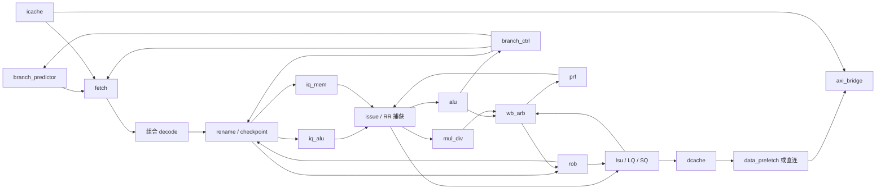

# 当前实现与接口约定

本文件描述 `verilog/filelist.f` 中的实际实现，是 RTL 接口、参数和开发流程的维护入口。实现为 **RV32IM、可配置单/双分派、单/双发射、乱序执行、顺序提交**；写回和提交宽度独立配置。默认 `DISPATCH_WIDTH=1, ISSUE_WIDTH=1`。RTL 使用 SystemVerilog 2005，构建器显式指定 `1800-2005`。存储器由官方 `scripts/ram/sram_fakeram.sv` 提供，构建与综合脚本负责加入它。

## 1. 文件布局与职责

| 目录 | 文件 | 职责 |
| --- | --- | --- |
| `verilog/` | `student_top.sv`、`filelist.f` | 参数、模块连接、综合文件清单 |
| `verilog/frontend/` | `fetch.sv`、`icache.sv` | PC、取指队列、generation 过滤、指令缓存 |
| 同上 | `decode.sv`、`branch_predictor.sv` | 组合译码；BTB、BHT 与全局历史预测 |
| `verilog/backend/` | `rename.sv`、`rename_dual.sv`、`prf.sv` | 单/双分派 RAT、物理寄存器分配、就绪位、检查点；物理寄存器值 |
| 同上 | `iq_core.sv`、`iq_alu.sv`、`iq_mem.sv` | 共用年龄关系、唤醒和选择；ALU 与访存队列适配 |
| 同上 | `issue.sv` | 单宽按年龄选一个 IQ 候选；双宽同时捕获算术与访存候选，保持执行单元入口 |
| 同上 | `wb_arb.sv`、`rob.sv`、`branch_ctrl.sv` | 写回仲裁、顺序提交、Store 授权；预测校验、恢复和训练 |
| `verilog/execute/` | `alu.sv`、`mul_div.sv` | 整数/控制流；乘除法 |
| `verilog/memory/` | `lsu.sv`、`dcache.sv` | 地址生成、LQ/SQ、Store 提交队列、转发；数据缓存 |
| 同上 | `data_prefetch.sv`、`axi_bridge.sv` | 三槽下一行预取；读写事务队列及外部总线 |
| `verilog/common/` | `pc_increment.sv`、`word_adder.sv`、`word_compare.sv`、`signal_fanout.sv`、`payload_ram.sv` | 地址增量、分组运算、控制信号分发及多读口 payload SRAM |
| `tb/monitor/` | `ipc_stats.sv`、`branch_stats_monitor.sv`、`branch_stats_bind.sv` | 仅仿真的性能计数和分支统计 |
| `scripts/dev/` | `instrumentation.py`、`ipc_profile.py`、`branch_accuracy.py`、`report.py` | 性能构建、采集和手动报告 |

`tb/monitor/` 包含上述监视器，`tb/unit/` 包含双分派与双发射的独立模块激励；两者都不进入 `filelist.f`，也不进入综合。`testcases/` 包含官方程序集。

官方工具仍位于 `scripts/`：`build.py`、`run.py`、`testcase.py`、`sim.cpp`、`oj_io.py`、`fakeram.py`、`toolchain.py`、`synth.py`、`synth_report.py`、`timing.py`、`timing.tcl` 和 `ram/sram_fakeram.sv`。开发工具统一放在 `scripts/dev/`，输出默认放在 `build/`。

## 2. 配置边界

顶层参数如下。宽度、ID 位数和 payload 总位数由容量自动推导，是模块内部 `localparam`，不能单独覆盖。

| 参数 | 默认 | 支持范围 / 约束 |
| --- | ---: | --- |
| `DISPATCH_WIDTH` | 1 | 1、2；每周期按程序顺序分配的 ROB 项数上限 |
| `ISSUE_WIDTH` | 1 | 1、2；每周期捕获 IQ 候选数上限，与分派/写回/提交宽度独立 |
| `WB_WIDTH` | 2 | 1、2、3；物理写口与 ROB 完成通道数 |
| `COMMIT_WIDTH` | 2 | 1 至 `ROB_DEPTH`；顺序提交上限 |
| `ROB_DEPTH` | 32 | 不小于 2 的 2 次幂 |
| `PRF_SIZE` | 56 | 大于 32；可非 2 次幂 |
| `IQ_ALU_DEPTH` / `IQ_MEM_DEPTH` | 7 / 4 | 正整数；可非 2 次幂 |
| `LQ_DEPTH` | 8 | 正整数；可非 2 次幂 |
| `SQ_DEPTH` | 8 | 不小于 2 的 2 次幂；提交 FIFO 使用循环下标 |
| `CHECKPOINT_DEPTH` | 4 | 正整数；可非 2 次幂 |
| `FETCH_QUEUE_DEPTH` | 16 | 不小于 2 的 2 次幂 |
| `IFETCH_OUTSTANDING` | 8 | 1 至 `FETCH_QUEUE_DEPTH` |
| `LOAD_OUTSTANDING` | 8 | 正整数；包括已取消但尚未返回的读事务 |
| `AXI_RD_OUTSTANDING` | 16 | 正整数；取指与数据读共享 |
| `ICACHE_SIZE_BYTES` / `DCACHE_SIZE_BYTES` | 2048 / 16384 | `WAYS × LINE_BYTES × SETS`，`SETS` 为正的 2 次幂 |
| `ICACHE_WAYS` / `DCACHE_WAYS` | 1 / 2 | 1、2、4 |
| `ICACHE_LINE_BYTES` / `DCACHE_LINE_BYTES` | 64 / 64 | 16 至 512 的 2 次幂 |
| `BP_ENABLE` / `DATA_PREFETCH` | 1 / 1 | 0 或 1；保留功能开关 |
| `BTB_ENTRIES` | 64 | 2 至 2^29 的 2 次幂 |
| `BHT_ENTRIES` | 256 | 2 至 2^30 的 2 次幂 |
| `GEN_WIDTH` | 16 | 正整数；在旧事务排空前必须避免 generation 重用 |
| `RESET_PC` | `32'h00000000` | 32 位、4 字节对齐 |

非法顶层组合在 elaboration/仿真初始化时报错。合法组合不会产生这些检查的硬件。表中范围表达结构约束；组合的实际面积和仿真成本随容量增长。

两个宽度独立支持 `(1,1)`、`(1,2)`、`(2,1)`、`(2,2)`。取指、I-cache 与组合 decode 始终每周期一条，fetch/decode 的 count 仍为 1 位。分派 count 宽度为 `DCW=ceil(log2(DISPATCH_WIDTH+1))`，有效分派包的 count 为 1 或 2；无效周期不据此分配。

双分派由 `rename_dual` 的两项译码缓冲形成有序前缀，不等待凑满两条。每包最多一条算术（含乘除/控制流）和一条访存；同类指令分周期分派。第一条资源充足即允许单条分派；两条均满足 ROB、物理寄存器、IQ、LSQ 与检查点需求时才分派两条。控制流或非控制流预测修正指令终止分派包。双发射每周期至多从 ALU IQ 和 MEM IQ 各取一条，不支持两条普通 ALU 同周期发射，也不复制执行单元。单宽通过 generate 保留原来的直接 rename、ROB metadata 和两读口 PRF 路径。

下列实现选择固定为当前路径：SRAM 检查点、顺序关系 IQ 选择、SRAM PRF、寄存 ALU 结果、独立分支解析、直接写回、LSU 注册地址调度与响应完成旁路、已提交 Store 缓冲、D-cache miss 下命中及部分 refill 命中、三槽预取和定向失效、全局历史预测。双宽扩展集中在 rename、ROB 分配、issue 和 PRF 读口，IQ/LSQ 各自仍只有一个分配入口。

`iq_core.MEM_QUEUE` 区分 ALU 队列与访存队列的 Store 就绪规则；`UOP_BITS` 和字段偏移用于这两种 payload 的适配。`rename.WAKE_WIDTH` 表示完成唤醒数，顶层固定接三源；它与 `WB_WIDTH` 不同。`dcache.BULK_REFILL` 由顶层 `DATA_PREFETCH` 连接。`axi_bridge` 直接使用 `LD_ID_WIDTH` / `IF_ID_WIDTH` 表示事务 ID 位数，不再借用队列深度表示它们；写队列容量在顶层固定为 16。

## 3. 主数据流与时序


```mermaid
flowchart LR
    BP[branch_predictor] --> F[fetch]
    IC[icache] --> F
    F --> D[组合 decode]
    D --> RN[rename / checkpoint]
    RN --> AQ[iq_alu]
    RN --> MQ[iq_mem]
    RN --> ROB[rob]
    AQ --> IS[issue / RR 捕获]
    MQ --> IS
    PRF[prf] --> IS
    IS --> ALU[alu]
    IS --> MUL[mul_div]
    IS --> LSU[lsu / LQ / SQ]
    ALU --> WB[wb_arb]
    MUL --> WB
    LSU --> WB
    WB --> PRF
    WB --> ROB
    ROB --> RN
    ROB --> LSU
    ALU --> BC[branch_ctrl]
    BC --> RN
    BC --> F
    BC --> BP
    LSU --> DC[dcache]
    DC --> PF[data_prefetch 或直连]
    PF --> AXI[axi_bridge]
    IC --> AXI
```

取指队列的 PC、预测 NPC、taken 与 instruction 存入 SRAM；空输出队列可以旁路输出。decode 是组合逻辑。单分派时直接进入原 rename；双分派时先进入两项缓冲，允许消费前缀和接收新指令同周期发生，后端恢复或前端修正清空该缓冲。rename 在 dispatch 边沿原子更新 RAT、ROB、LSQ 和检查点。IQ 普通完成唤醒与 ALU early wake 都可参与同周期候选选择，并在边沿更新源 ready。没有就绪驻留项时，新分派且操作数就绪的指令可以旁路 IQ 直接进入 issue；被当周期选走的新指令不占用 IQ 有效项。单发射在两个队列的可接收候选之间按 ROB 年龄选一条；双发射可同时捕获两个队列的候选，各自的执行槽回压独立处理。ALU、MUL、MEM 三个保持槽分别服务执行单元。

ALU 结果寄存后参与完成仲裁，乘除法和访存具有各自的多周期状态。写回直接送到 PRF 和 ROB；ROB 依据已完成位从 head 提交连续前缀。普通指令的本周期写回在边沿更新完成位，下一周期可提交；head Store 授权额外检查本周期完成通道。

分支解析使用 RR 槽的独立操作数路径，每条控制流指令只宣布一次，且不等待结果写回仲裁。ALU 给出真实 next-PC，`branch_ctrl` 校验检查点后发出恢复、重定向和训练。这些路径有旁路与独立状态，不能用一条固定阶段数来代表所有指令延迟。

## 4. 通用握手、编号与压紧布局

- 普通请求以 `valid && ready` 在上升沿完成接收；未接收时发送端保持有效请求的身份和内容。执行结果在回压时由执行单元/LSU 保持。
- IQ 的 `cand_take` 是候选消费事件。顶层 `disp_fire = disp_valid && disp_ready` 是唯一架构分配事件；各队列只能在它发生时将 prepared 数据标为有效。
- `disp_prepare`、资源充足时的 SRAM/数组预写、地址/恢复预览都可以早于 fire，不能据此更新有效位或资源计数。
- `*_rsp_valid`、resolve、训练、Store 授权/完成是事件信号，没有独立 ready。接收模块负责无损消费或内部保持。
- clock 上升沿更新状态，reset 为高有效同步复位。有效位复位后，未初始化的无效 payload 不可作为有效事务使用。
- 多路扁平总线的第 0 路位于最低位：`payload[lane*BITS +: BITS]`。提交路由从最老到较新排列。
- ROB tag 是环形下标；年龄为固定 `RW` 位的 `tag - rob_head`。squash 保留触发分支及更老指令，丢弃严格更年轻的指令。
- 请求身份用 `{generation, id}`；generation 不是外部 AXI ID。缓存 refill 和桥内队列保存原请求身份，返回时原样携带。

记 `W(n)=max(1,ceil(log2(n)))`：`RW=W(ROB_DEPTH)`、`PW=W(PRF_SIZE)`、`LIDW=W(LQ_DEPTH)`、`SIDW=W(SQ_DEPTH)`、`FIDW=W(FETCH_QUEUE_DEPTH)`、`CIDW=W(CHECKPOINT_DEPTH)`、`MIDW=max(LIDW,SIDW)`、`G=GEN_WIDTH`。ROB、outstanding 和已提交 Store FIFO 的计数宽度为 `ceil(log2(DEPTH+1))`。IQ/LQ/SQ/检查点对 rename 提供 1 位 `alu_iq_has_free`、`mem_iq_has_free`、`lq_has_free`、`sq_has_free`、`cp_has_free`；1 表示至少一个当前无效项，不能解释为精确空项数量。`iq_core` 对 wrapper 的对应输出为 `has_free`，不将当周期释放计入当前空位。`IFID=log2(ICACHE_LINE_BYTES/4)`，`DCID=log2(DCACHE_LINE_BYTES/4)`。

以下 payload 均按 **高位到低位** 列出，方括号为字段宽度。默认 `RW=5, PW=6, LIDW=3, SIDW=3, FIDW=4, CIDW=2, MIDW=3, G=16, IFID=4, DCID=4`。

| 通道 / payload | 字段：高位 → 低位 | 位数公式 | 默认 |
| --- | --- | --- | ---: |
| fetch packet | `pc[32], inst[32], pred_npc[32]` | 96 | 96 |
| decode uop | `pc[32], pred_npc[32], op[6], rs1[5], rs2[5], rd[5], imm[32]` | 117 | 117 |
| ROB alloc | `old_pdst[PW], kind[2], sq_id[SIDW]` | `PW+2+SIDW` | 11 |
| ALU IQ | `rob[RW], cp[CIDW], op[6], pdst[PW], psrc1[PW], psrc2[PW], pc[32], imm[32]` | `RW+CIDW+6+3*PW+64` | 95 |
| MEM IQ | `rob[RW], mem_op[3], mem_id[MIDW], psrc1[PW], psrc2[PW], imm[32]` | `RW+3+MIDW+2*PW+32` | 55 |
| LSQ alloc | `is_store[1], mem_id[MIDW], rob[RW], pdst[PW]` | `1+MIDW+RW+PW` | 15 |
| checkpoint alloc | `cp[CIDW], rob[RW], pred_npc[32]` | `CIDW+RW+32` | 39 |
| ALU execute | `rob[RW], cp[CIDW], op[6], pdst[PW], pc[32], imm[32], a[32], b[32]` | `RW+CIDW+6+PW+128` | 147 |
| MUL execute | `rob[RW], mul_op[3], pdst[PW], a[32], b[32]` | `RW+3+PW+64` | 78 |
| MEM execute | `rob[RW], mem_op[3], mem_id[MIDW], base[32], imm[32], data[32]` | `RW+3+MIDW+96` | 107 |
| FU result | `rob[RW], pdst[PW], value[32]` | `RW+PW+32` | 43 |
| branch resolve | `rob[RW], cp[CIDW], pc[32], conditional[1], taken[1], target[32], npc[32]` | `RW+CIDW+98` | 105 |
| predictor train | `pc[32], conditional[1], taken[1], target[32]` | 66 | 66 |
| fetch redirect | `pc[32], generation[G]` | `32+G` | 48 |
| register commit | `old_pdst[PW]` | `PW` | 6 |
| fetch ↔ I-cache | `generation[G], fetch_id[FIDW], count[1], addr/inst[32]` | `G+FIDW+1+32` | 53 |
| I-cache ↔ AXI bridge | `generation[G], word_id[IFID], addr/data[32]` | `G+IFID+32` | 52 |
| LSU ↔ D-cache load | `generation[G], lq_id[LIDW], addr/data[32]` | `G+LIDW+32` | 51 |
| D-cache ↔ memory load | `generation[G], word_id[DCID], addr/data[32]` | `G+DCID+32` | 52 |
| prefetch ↔ AXI bridge load | `generation[G], slot[2], word_id[DCID], addr/data[32]` | `G+2+DCID+32` | 54 |
| Store / writeback | `addr[32], data[32], strb[4]` | 68 | 68 |

双分派时仅 `disp_rob` 扩展为 `DISPATCH_WIDTH*ROB_ALLOC_BITS` 位，第 0 路为最老指令，ROB tag 为 `rob_tail+lane` 的环形下标。`disp_alu`、`disp_mem`、`disp_lsq` 和 `cp_alloc_payload` 仍为单条 payload，分别承载包内唯一的算术、访存和末尾分支。顶层 `disp_src1_ready/disp_src2_ready` 为两位，bit 0 对应 ALU IQ，bit 1 对应 MEM IQ；单分派时复制同一组 ready。`alu_disp_prepare/mem_disp_prepare` 表示包内对应类别，`alu_disp_valid/mem_disp_valid` 只在 `disp_fire` 时有效。

`rd_addr` 为 `2*ISSUE_WIDTH*PW` 位，`rd_data` 为 `64*ISSUE_WIDTH` 位。单发射的两个读口服务所选候选；双发射的读口 0/1 固定服务算术候选的 rs1/rs2，读口 2/3 固定服务访存候选的 rs1/rs2。`prf.READ_PORTS=2*ISSUE_WIDTH`，读口增加不会复制物理存储或增加写回源。

`DATA_PREFETCH=0` 时 D-cache load 通道直接接桥，`LD_ID_WIDTH=DCID`；启用时为 `DCID+2`，slot=0 表示 demand，slot=1/2/3 表示三个预取槽。整行 refill 通道 `line_req_valid/ready` 不另带地址，使用同周期 D-cache memory load payload 的行地址；`line_rsp_data` 为 `DCACHE_LINE_BYTES*8` 位，低位对应行内最低地址的字。

译码内部 op 编号如下，属于模块间协议，不是 RISC-V 指令编码。

| op | 顺序映射 |
| --- | --- |
| 0–10 | NOP, LUI, AUIPC, JAL, JALR, BEQ, BNE, BLT, BGE, BLTU, BGEU |
| 11–19 | ADDI, SLTI, SLTIU, XORI, ORI, ANDI, SLLI, SRLI, SRAI |
| 20–29 | ADD, SUB, SLL, SLT, SLTU, XOR, SRL, SRA, OR, AND |
| 30–37 | LB, LH, LW, LBU, LHU, SB, SH, SW |
| 38–45 | MUL, MULH, MULHSU, MULHU, DIV, DIVU, REM, REMU |

`mem_op=op-30`、`mul_op=op-38`。ROB kind：0 普通，1 控制流，2 Load，3 Store。未使用的源寄存器置 0；architectural x0、physical 0 始终为零，`rd=0` 不分配物理目的寄存器。

## 5. rename、IQ、操作数与写回

rename 在 reset 时建立 32 个 architectural register 的初始物理映射，其余寄存器进入 free 集合。目的寄存器分配、RAT 更新、目的 ready 清除与 dispatch 原子发生。ROB 保存旧映射，提交时回收 `old_pdst`，不是当前目的寄存器。完成唤醒在边沿把物理目的标记为 ready。分派输出的源就绪只查 physical 0 和 ready 位；IQ 分派边沿再匹配全部唤醒，接住同周期完成。

`rename_dual` 对包内两条指令分配不同的非零目的寄存器。lane 1 的 rs1/rs2 和 `old_pdst` 通过 lane 0 的目的更新旁路，因此 RAW 等待 lane 0 完成，WAW 的旧映射指向 lane 0 新分配的物理寄存器。x0 不分配；第二条资源不足时只消费第一条。包末分支的检查点保存整个包更新后的 RAT；该包分配的物理寄存器不加入自身检查点的 younger 集合，但加入所有更老的有效检查点。缓冲中的译码指令不拥有任何后端资源。

每个控制流检查点保存包含该指令目的更新后的 RAT，以及后续物理分配集合。RAT 检查点分 bank 存入 SRAM；单分派的空闲 bank 可在控制流分派握手前预写，双分派在真实 `cp_alloc_valid` 时写入整个包更新后的 RAT。实际有效分配与最近一次有效写入 ID 由 `cp_alloc_valid` 更新。读数据提前准备，最近一次有效写入的检查点通过旁路恢复。因此 squash 边沿可以直接恢复 RAT，并回收更年轻的物理分配，不增加恢复等待状态。释放 mask 同时维护 rename 与 branch_ctrl 的检查点有效状态。

`iq_alu` 与 `iq_mem` 共用 `iq_core` 的 entry、源就绪、年龄关系和选择实现。普通候选要求两个实际使用的源 ready。Store 可以在 base ready 后先生成地址，data readiness 独立携带，由 issue/LSU 后续补齐；Load 按其源要求选择。单分派的空槽选择用 free bitmap 的前缀 OR 生成 first-free one-hot，无精确 free rank。驻留的最老就绪候选优先于新分派旁路。新指令的 payload 可提前准备，只有真实分派且源 ready 时才产生有效旁路候选；`cand_take` 消费旁路时抑制 IQ 分配有效位。两个队列各提供一个候选，issue 在可接收的候选之间按 ROB 年龄选一条。

PRF 有 `2*ISSUE_WIDTH` 个读口和 `WB_WIDTH` 个写口，存储值使用 SRAM，当前写口按 8-word bank 与 word 两级译码；多个写口指向同一项时较高路号优先，physical 0 不写入。先选择 SRAM 读出字，再按读口匹配上一周期写回并旁路；同一读口匹配多个写口时较高路号优先。issue 另保留当前/上一周期完成转发；每个保持槽独立捕获对应读口数据，操作数即使执行单元回压也会在槽中更新。完成源顺序固定为 ALU=0、MUL=1、LSU=2，与物理写回路数无关。

rename 接三源完成唤醒；IQ 接三源完成唤醒加一源 ALU 提前唤醒。IQ 约定 `wake` 最后一路为 ALU early wake，其他路为普通完成；全部路进入当前候选组合选择，并参与驻留项和新分派项的 ready 更新。ALU 的提前唤醒领先寄存结果一个周期，后续实际值由当前 ALU 结果转发。MUL/LSU 普通完成唤醒后，使用者在下一周期进入执行槽，使用上一周期完成值；它们的当前结果仅进入 Store data 的同周期转发。保持槽持续保存已转发操作数，回压时不丢值。

乘法采用 unsigned 32×4 的 radix-16 迭代：接收时将乘数放入组合 accumulator 的低 32 位，每个 MUL_ADD 边沿加一个 nibble 的部分积后右移四位，共八步。随后一拍根据符号修正高 32 位，输出 MUL/MULH/MULHSU/MULHU 结果。符号修正保存两个符号条件，操作数复用 multiplicand 与 divisor 寄存器，乘除法在单元内互斥。除法继续逐位 restoring division，保留除零与有符号溢出的结果约定。乘除法结果由同一保持状态等待写回消费。

`wb_arb` 每周期接受最多 `WB_WIDTH` 个三源结果。宽度不小于 2 时第 0 路优先接受 ALU，其余按轮转选择；宽度 1 时三源轮转。每个源最多被选一次。被 squash 的年轻结果仍可被消费，但不置 `done_valid` / `write_valid`。非零 pdst 才写 PRF；pdst=0 的有效完成仍更新 ROB。仲裁后的完成通道和写口数都不超过配置值。

## 6. 控制流、ROB 与 Store 提交

预测器采用 BTB、2 位 BHT 和固定 8 位全局历史，BTB 的值存储使用 SRAM。最近一次 BTB 写入仅在选中 lookup index 后统一旁路；同 index 但 PC tag 不同的最近更新必须屏蔽旧 hit。`BP_ENABLE=0` 时输出顺序 next-PC。fetch 把预测 next-PC 放进 packet；rename 对非控制流却预测成跳转的情况发出前端修正，不触发后端 squash。

`branch_ctrl` 仅接受 cp 有效、cp ID 在范围内且 cp ROB tag 匹配的 resolve。比较真实 npc 与保存的 pred_npc，错误时恢复该检查点、释放该检查点及更年轻检查点、保留触发分支和更老指令。正确解析释放自身检查点。分支解析与结果写回路径独立。匹配解析才训练预测器，失效检查点的旧结果不能训练或重定向。后端 mispredict 重定向优先于前端修正；每次重定向将 generation 加 1。

ROB 维护环形 head/tail、有效占用和完成位。分配 metadata `{old_pdst, kind, sq_id}` 使用多读口 payload SRAM，各提交口读取从 head 开始的连续项；空闲 tail 可提前写入，真实 dispatch 才增加有效占用。只有队头能够持有 Store 授权状态，队头推进时清除该状态，Store 应答在同一提交边沿消费。每周期提交最多 `COMMIT_WIDTH` 条连续最老完成指令；遇到未完成项停止。squash 同周期可以提交保留范围内的旧指令，不得跨越触发分支删除范围。

`rob.DISPATCH_WIDTH` 与顶层一致。双分派 metadata 按 ROB tag 奇偶分为两个 SRAM bank，每 bank 仍只有一个写口；连续两项及 tail 回绕都分别落入不同 bank。每个提交读口按 tag 选择 bank。仅 `disp_fire` 消费的前缀清完成位、增加占用并推进 tail，增量为 `disp_count`。

Store 地址和数据准备完后先报告 FU 完成；只有已完成且位于 ROB head 的 Store 才发 `st_start_valid/st_start_id`，每条仅授权一次。RAM Store 交给 LSU 已提交 FIFO 后，同周期 `st_done_valid` 允许它退休，随后连续的普通完成指令也可以退休；提交前缀中的第二个 Store 要等成为 head 再授权。非 RAM Store 等真实外部写响应后退休。

已提交 Store 的 SQ 项直到 D-cache 返回写完成才释放，FIFO 保持写入顺序且跨 squash 保留。SQ 在分配时维护项间的年龄矩阵，已提交项的相对顺序跨 ROB 下标重用保留。Load 并行比较所有更老 Store 的地址和字节掩码，年龄矩阵选出最新重叠项，数据按 one-hot 选择后扩展到 Load 结果。ROB 退休并不表示 RAM Store 已经写到外部存储器。

LSU 提前读取已提交 Store FIFO 的当前队头和下一项，缓存的当前写完成仅控制最后一级数据选择，使下一条 Store 可以立即发出。LSU 完成选择与写回仲裁的 one-hot 数据选择按 16-bit 分组分发，仲裁顺序和有效握手保持原协议。D-cache 的 valid/dirty 读取采用低位 one-hot 分组和高位组选择，普通请求与 miss 期间命中探测各有独立读取路径。

顶层将完成 valid/pdst 分发至 rename、两个 IQ、issue 和 LSU，完成值保持原路序。D-cache 返回 packet 的 hit-under-miss 选择按 16-bit 分组分发；metadata 地址读取与 valid/dirty 更新译码通过缓冲隔离。

ALU 的真实 next-PC 选择和乘除单元宽寄存器写使能按 16-bit 分组分发。乘除单元的状态、计数器和恢复优先级保持原流程，数据分组不增加流水级或运算周期。

## 7. LSU、缓存与外部事务

LSU 分派时分配 LQ/SQ 项；AGU 计算 `base+imm` 并在 MEM 执行握手边沿写入 LQ 的地址、op 与状态，下一周期再进行 Load 调度。issue 仍提供 `mem_exec_preview_valid`（连接 LSU 的 `read_exec_valid`），该预览不再参与 Load 选择或请求地址旁路；调度只依赖注册 LQ。访存请求按字地址发送，SB/SH/SW 根据 byte offset 左移数据并生成 strobe，Load 根据 offset 和 mem_op 扩展有符号/无符号结果。软件应使用自然对齐访问；实现没有跨字拼接或 misalignment trap。

Load 检查所有更老未提交 Store 与已提交 Store。存在未知地址 Store 时等待；地址重叠时，仅在最新重叠 Store 覆盖完整 Load 字节集合且数据 ready 时转发，否则等待。Load 候选经过依赖检查后按 round-robin 选择，指针从已选项的下一项开始并在深度末尾显式回绕。已保存的 Load 完成和地址/数据就绪的未报告 Store 也按 round-robin 选择，ROB 仍顺序提交。Load 可通过空请求缓冲直接向缓存发请求，但地址只来自已寄存 LQ；有回压则保持 generation、ID 和 LQ 地址。LSU 优先输出结果保持缓冲中的完成；缓冲空闲时，当前匹配的缓存响应可携带 tag、pdst 和扩展后的数据直接旁路到 completion，并优先于队列中已就绪的完成。响应同时写入 LQ 数据/状态，未当周期消费的响应由 LQ 或结果缓冲保存。完成指针仅在结果被消费或捕获到保持缓冲时推进；当前响应优先于队列项，不承诺两者之间的 RR 公平性。

LQ 返回匹配同时要求 entry 有效、等待响应状态、ID 和 generation 相同。squash 不能取消已经发到缓存/桥的事务：所有真实读响应都归还 outstanding credit，失效响应不得写入重用的 LQ 项或产生完成。已准备好的 LQ 请求允许 squash 边沿接受读请求，其返回仍带原 generation 并被过滤。

I-cache 响应预览保持已捕获的 request generation，不由同周期 redirect 屏蔽；fetch 的对外有效握手仍由 redirect 屏蔽，重定向边沿清空队列所有权。这样恢复控制不会经响应有效性改变待译码的指令 payload。

I-cache 首次 miss 的地址、set/way、generation、计数与有效状态通过八组 `fill_capture` 缓冲分别捕获；使能仍是 `request_fire && !hit_found && !fill_busy`，不增加寄存级或改变请求/响应周期。分组限制分支恢复控制到取指请求寄存器的扇出。

fetch 输出队列的 `output_count==0` 通过七组 `packet_bypass` 分发到六个 16-bit packet 选择块和 count 选择块；空队列旁路、非空队列出队及重定向逻辑保持原时序。

fetch 的 `!reset && !fetch_redirect_valid` 通过四组 `frontend_run` 分别驱动 create、输出缓冲装载、I-cache 请求和 fetch 有效信号。LSU 的 `disp_valid && !squash_valid` 通过五组 `dispatch_capture` 分别驱动 Store 标志/ROB tag、Load 标志/ROB tag/pdst 捕获；分组均为组合缓冲，不改变分配事件或流水周期。

fetch 的同步清空通过 `FETCH_QUEUE_DEPTH+1` 组 `frontend_clear` 分别服务各取指槽和公共状态。未被 I-cache 接受的首次请求通过七组 `offer_capture` 保存 count/taken、PC、next-PC 和预测 NPC，其中三个地址均按 16-bit 捕获；offer_valid 仍在原边沿置位，已保持请求的内容和身份保持原握手约定。

取指队列 metadata SRAM 保存 `{pc[32], pred_npc[32], taken[1]}`，instruction SRAM 保存 32 位指令；有效状态留在寄存器中。所有存活项属于当前 fetch generation，重定向同时清空项状态和输出队列，因此不逐项保存 generation。metadata 仅预写当前空闲 tail；真实 `create_fire` 才占用它。I-cache 接收 fetch queue ID，miss 时按行内字编号 refill，命中经 SRAM 返回。标签按 way 放入 payload SRAM，选中 set 后比较一次 tag，最近写入旁路覆盖 SRAM 写周期的无效读输出。取指重定向不会撤销已经启动的物理 refill，fetch 按 generation 忽略旧逻辑响应。D-cache 为 write-back/write-allocate：脏替换先写回再 refill；支持 refill 期间其他已缓存行的 Load 命中，以及当前行已返回字的 Load 命中，冲突请求内部保持/重试。Store 命中可连续流水，mask 只修改相应字节。

数据预取使用三个下一行槽，只在没有外部 demand 请求时发预取；缓存行数据保存在 SRAM。完整预取行可通过整行接口 refill，部分行可按字提供。D-cache 向桥发送的写请求握手时，`write_fire/write_addr` 按地址定向失效相同预取行，覆盖脏行写回和 I/O 写；已经发出的旧预取须排空，不能让旧数据重新变为命中。`DATA_PREFETCH=0` 时顶层直接连接 D-cache 与桥，关闭整行预取接口。

RAM 地址范围为 `0x00000000..0x0fffffff`，按 little-endian 访问。非 RAM Load 返回零，不发外部读；非 RAM Store 进入 I/O 路径，D-cache 先排空脏数据，再发送写事务。I/O drain 的每行最后一字被桥接收后即清除 dirty 并继续扫描下一行；`flush_outstanding` 跨行统计已接收但未应答的回写。只有所有脏行发送完成且 outstanding 归零，才进入 I/O 发送。普通脏替换仍等待该行所有应答后 refill。官方模拟器使用 `SW 0x80000000` 作为程序结果/退出写，结果完成需经过外部写响应；不加入 CSR、中断、异常或 MMU 接口。

顶层外部端口保持原协议，方向相对 CPU：

| 组 | CPU 输出 | CPU 输入 |
| --- | --- | --- |
| 时钟/复位 | — | `clock, reset` |
| 读地址 | `araddr[32], arvalid` | `arready` |
| 读返回 | `rready` | `rdata[32], rresp[2], rvalid` |
| 写地址 | `awaddr[32], awvalid` | `awready` |
| 写数据 | `wdata[32], wstrb[4], wvalid` | `wready` |
| 写返回 | `bready` | `bresp[2], bvalid` |

这是课程环境的无 ID、无 burst 五通道接口。桥在取指和数据读之间轮转，把 generation/ID 存入共享 FIFO；AR 可以有多笔 outstanding，R 必须按 AR 接收顺序返回。AW/W 独立握手，分别按写队列顺序发出，B 在对应 AW 和 W 都接收后才能消费，并须按写入顺序返回。reset 时环境应同步清空在途事务。当前实现不处理 `rresp/bresp` 错误，环境应提供成功响应。

桥的读地址、读身份 `{generation, id, is_load}` 和写请求 payload 均使用 `payload_ram`。写队列为 AW、W 提供两个独立读口，二者不必指向同一项；指针与 outstanding 计数仍由桥维护。

`payload_ram` 参数为 `DEPTH`、`WIDTH`、`READ_PORTS`，地址宽度 `IW=W(DEPTH)`。接口为 `write_valid/write_addr[IW]/write_data[WIDTH]` 和扁平的 `read_addr[READ_PORTS*IW]/read_data[READ_PORTS*WIDTH]`，第 0 读口位于低位。每个 SRAM word 持续同步读取，读选择使用分组 one-hot mask；最近一次写入在各读口选中后统一旁路。写入在 clock 上升沿发生，reset 清旁路有效位；项有效性、分配和释放由调用模块维护。写数据每两个 word 共用一个 `signal_fanout` 分支，宽控制信号按读出分组分发。

## 8. 性能监视与输出

普通 `make build/test/perf/synth` 不编译 monitor。开发构建器在 filelist 之外加入三个 monitor，以 `bind` 接当前顶层和 branch_ctrl；启用断言并继续使用 SystemVerilog 2005。`sim.json` 保存参数覆盖、语言和输入 SHA-256，防止复用普通无监视器二进制或把不明配置当作本次结果。

`ipc_stats.sv` 在非 reset 上升沿累计 dispatched、issued、retired、空候选、发射回压、前端/rename/队列阻塞、head Load/Store 等待、mispredict、缓存等待和 WB 冲突。阻塞计数可以重叠，不能相加当作总停顿。它按配置检查 dispatch、issue、WB/commit 上限。输出到 stderr 的 `CPU2026 ipc_profile ...` 保留原计数字段；另输出 `CPU2026 multi_width dual_issue_cycles=... dual_dispatch_cycles=...`，分别统计真实捕获两条候选、真实分配两项 ROB 的周期数。

IPC 的程序指令数来自官方 workload 信息；分母使用模拟器报告的 `CPU2026 cycles`。monitor 的 cycles 是其采样次数，独立记录。issued/dispatched 可以包含后来被取消的指令，不作为程序动态指令数。性能汇总保留逐程序 cycles/instructions/IPC 和几何平均 IPC。

分支监视以检查点匹配的存活解析为统计事件，按 PC 与 conditional/jump 分组。正确条件是 **真实 next-PC 等于预测 next-PC**，所以同时包含方向和目标正确性。已解析但随后被更老分支取消的事件不会追溯删除；这不是最终退休分支统计。stderr 协议保留 `version=1 scope=resolved_next_pc`；JSON、CSV 记录 predictions、correct、taken、taken_correct 及准确率。

| 入口 | 输出 |
| --- | --- |
| `make ipc-profile` | `IPC_STATS_OUT`，默认 `$(BUILD)/ipc-profile`；`profile.json`、`sim.json`、`build.log`、逐程序 stdout/stderr、监视仿真器 |
| `make branch-accuracy` | `BP_STATS_OUT`，默认 `$(BUILD)/branch-accuracy`；汇总 JSON/CSV、逐 PC CSV、构建与程序日志 |
| `make report` | `REPORT_OUT`，默认 `$(BUILD)/reports`；时间戳/commit 命名的文本报告和对应 `.build` 目录 |
| `make synth` | `SYNTH_OUT/MODE`，默认 `build/synth/opt`；面积、时序和完整工具日志 |

性能脚本比较程序期望输出、检查 stderr 协议和 cycles；失败写入报告并返回非零。分支脚本默认跑 correctness+perf，IPC 脚本默认只跑 perf。`--kind all` 可让 IPC 脚本执行完整官方程序集，`--case` 可重复指定多个程序。

## 9. 构建、回归与报告流程

从仓库根目录运行，已有 `cpu2026:latest` 镜像时可用下列 Docker 命令；容器内 `APPIMAGE=` 使用镜像自带工具。

```sh
docker run --rm --network none --user "$(id -u):$(id -g)" \
  --mount "type=bind,source=$PWD,target=/work" --workdir /work \
  cpu2026:latest make test APPIMAGE= MAX_CYCLES=100000000 JOBS=2
```

在相同容器环境中依次执行：

```sh
make perf APPIMAGE= MAX_CYCLES=100000000 SIM=/work/build/sim
make ipc-profile APPIMAGE= JOBS=2
make branch-accuracy APPIMAGE= Case=perf_qsort JOBS=2
make synth APPIMAGE=
```

`make test/perf` 使用官方 `scripts/testcase.py`。默认 `MAX_CYCLES=1000000` 不足以完成所有长 correctness 程序，完整回归须显式提高；开发性能入口默认 `BP_MAX_CYCLES=100000000`。`SIM=...` 可以复用已构建普通仿真器；官方 `make build` 不接受 RTL 参数覆盖。

参数比较可使用监视构建器：

```sh
make ipc-profile APPIMAGE= Case=perf_qsort \
  PARAMETERS="WB_WIDTH=1 COMMIT_WIDTH=4" IPC_STATS_OUT=build/wb1-commit4
python3 scripts/dev/ipc_profile.py --appimage '' --kind all --jobs 2 \
  --parameter WB_WIDTH=3 --parameter COMMIT_WIDTH=1 --out build/wb3-commit1
make branch-accuracy APPIMAGE= BP_WB_WIDTH=1 BP_COMMIT_WIDTH=2 BP_ENABLE=0
```

参数只允许顶层实际声明的名称，值为十进制或 `0x` 十六进制整数；未知、重复和已删除参数报错。IPC 的 `--sim` 只接受同目录有 `sim.json` 的监视器二进制，复用时不能同时指定参数覆盖。

在宿主机运行 `make report JOBS=2`，会手动、顺序启动 Docker 完成 correctness → perf → IPC → synth；任何一项失败仍保留该项日志，最终返回非零。报告记录 commit、工作区状态及当前源码散列，包含未提交的重构代码。`.githooks/post-commit` 已删除，仓库本地 `core.hooksPath=.githooks` 已取消；提交不再自动触发构建或报告。

`make` / `make code` 保留 OJ 的 `./code` 入口。综合面积与时序报告由官方 synth/timing 工具产生；Windows 的构建、正确性、性能和综合入口见 `toolchain/USAGE.md`，可分别调用并复用与当前源码一致的仿真器。

开发加速入口为 `scripts/dev/fast.py build|test|perf|synth`，Make 对应 `fast-build/fast-test/fast-perf/fast-synth`。Windows 的 `windows.py` 和三个 PowerShell 快捷入口调用同一开发实现。构建继续使用官方 `scripts/sim.cpp`、SRAM 模型、波形和断言，语言为 `1800-2005`；C++ 热路径和运行库默认 `-O3`，`--optimization size` 选择 `-Os`。`--jobs` 控制构建并行数，`--test-jobs` 控制独立用例进程数，结果按官方用例顺序输出。

普通开发 `build/test/perf` 也接受可重复的 `--parameter NAME=VALUE`，与监视构建共用顶层名称校验和参数缓存身份；不能与 `--sim` 同用。Windows 双宽入口示例：

```powershell
.\toolchain\oss-cad-suite\lib\python3.exe toolchain/windows.py test --parameter DISPATCH_WIDTH=2 --parameter ISSUE_WIDTH=2 --out build/dual --jobs 8
.\toolchain\oss-cad-suite\lib\python3.exe scripts/dev/test_multi_issue.py
.\toolchain\oss-cad-suite\lib\python3.exe toolchain/windows.py synth --out build/single-synth --clock-period 3.3333333333333335
```

第二条命令用 Verilator `1800-2005` 运行独立模块激励，输出在 `build/multi-unit`；它不改变官方程序集或 CPU 外部接口。综合默认使用顶层参数默认值；配置其他参数的实例时，须将同一组覆盖用于 Yosys elaboration 和仿真。

构建目录内的 `.flow-build.json` 记录输入配置和产物散列，`sim.json` 保留参数、源码 SHA-256、语言、监视模式和编译选项。输入包含 filelist、RTL、字面量 include、驱动、监视器、工具及 Verilator 运行库；配置相同时直接复用二进制，源码变化时重新生成模型并由 Make 增量编译。不兼容配置和 `--force` 清理对象目录；失败构建不保留旧二进制或可复用 manifest。目录锁保证同一构建目录只有一个写入流程。

正确性/性能使用官方 `prepare_case/compare_output` 及 cycles 协议，每次运行写入逐程序 stdout/stderr 和 `results/correctness.json` 或 `results/perf.json`。显式 `--reuse-results` 根据仿真器、程序/答案/指标、上限、延迟和超时复用成功结果，JSON 的 `reused` 与控制台复用数量描述其来源；`--result-cache` 指定结果缓存目录。任一性能用例失败时不输出部分 GEOMEAN，退出码非零。

综合目录内 `.flow-synth.json` 保存成功面积与时序产物的输入/输出散列，`.flow-elaborate.json` 和 `.flow-synth-stage.json` 分别描述 Yosys elaboration 与映射阶段。源码、库、工具、脚本、已有 `abc.constr`、模式、时钟端口和周期参与缓存选择；变更目标周期复用 elaboration 后重新映射和分析时序。仍调用官方 `synth.py/fakeram.py/timing.py` 生成面积与 OpenSTA 报告。

Windows 完整报告的 `--cache-dir` 默认 `build/windows-report-cache`，普通仿真器、监视仿真器与综合分别使用独立子目录；时间戳 `.build` 保存本次日志和产物快照。`--targets` 选择报告阶段，默认仍为 correctness → perf → IPC → synth；`--reuse-results` 控制测试结果复用，`--force` 重新构建/综合。报告记录阶段耗时和复用数量，单项失败仍继续后续阶段并最终返回非零。
